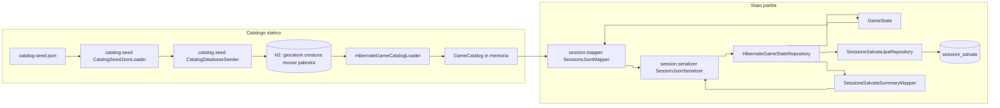
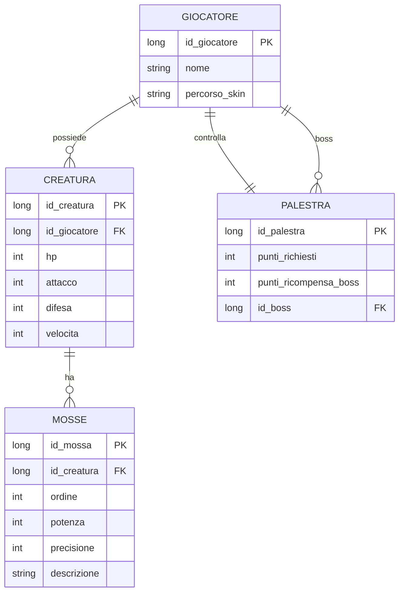

# Dati e persistenza

> [← Indice Wiki](https://github.com/ValerioGiglio04/rpg-MPGC/wiki/Home) · [Architettura](https://github.com/ValerioGiglio04/rpg-MPGC/wiki/Responsabilita-e-architettura) · [Classi](https://github.com/ValerioGiglio04/rpg-MPGC/wiki/Classi-e-interfacce) · [Estendibilità](https://github.com/ValerioGiglio04/rpg-MPGC/wiki/Estendibilita)

La persistenza è organizzata in **due ambiti distinti**, coerenti con la separazione **catalogo statico** vs **stato dinamico della partita**:

| Ambito | Tecnologia | Percorso |
|--------|------------|----------|
| **Catalogo** (creature, mosse, palestre, giocatori/boss) | Hibernate 6 + H2 (file) | `~/.rpg-palestre-creature/save.*` |
| **Sessioni di partita** (progresso, più slot) | Hibernate 6 + H2 (CLOB JSON) | tabella `sessioni_salvate` nello stesso file H2 del catalogo |

### Identificatori numerici (`long`)

| Livello | Tipo di id | Esempi |
|:--------|:-----------|:-------|
| **Dominio** (`Creature.catalogId`, `GymRoom.id`, template catalogo) | `long` | `1`, `2`, `5` |
| **`catalog-seed.json`** | `long` | Stessi valori del catalogo H2 |
| **JSON in `dati_salvati_json`** | `long` (`id_*`) | `id_creatura`, `id_palestra` |
| **Tabelle H2 del catalogo** | `long` PK | `id_creatura`, `id_palestra`, `id_giocatore` |

Un solo tipo di id su tutti i livelli: niente mappe `codice ↔ id` né colonne `codice` duplicate.

---

## Panoramica

> Diagrammi Mermaid in questa pagina: bozze con **ChatGPT / Claude**, adattate al progetto ([dettaglio](https://github.com/ValerioGiglio04/rpg-MPGC/wiki/Dichiarazione-AI#grafici-mermaid-nella-wiki-chatgpt-e-claude)).



| Tipo dato | Contenuto | Dove vive | Mutabilità in partita |
|-----------|-----------|-----------|------------------------|
| **Catalogo** | Template creature, mosse, palestre, boss, impostazioni nuova partita | H2 + `GameCatalog` in RAM | Solo lettura durante il gioco |
| **Salvataggio** | Gloria, team (id + HP), palestre completate, palestra corrente, posizione mappa | Riga in `sessioni_salvate` (`dati_salvati_json`) | Aggiornato a ogni save manuale; più partite in parallelo |

---

## Configurazione JPA (catalogo + sessioni)

File: `src/main/resources/META-INF/persistence.xml`

- **Persistence unit:** `rpg-palestre-creature`
- **Provider:** Hibernate 6
- **URL JDBC:** `jdbc:h2:file:~/.rpg-palestre-creature/save;AUTO_SERVER=TRUE`
- **Utente / password:** `sa` / vuota
- **DDL:** `hibernate.hbm2ddl.auto = update`

Entità registrate in `catalog.entities` e `session.entities`: `GiocatoreEntity`, `CreaturaEntity`, `MossaEntity`, `PalestraEntity`, `SessioneSalvataEntity`.

Il database H2 è un **file locale** nella home dell'utente, non nel repository Git.

### Ispezione del database catalogo

```bash
./gradlew h2Console
```

Apre la console web H2 con le stesse credenziali del `persistence.xml`.

---

## Catalogo statico

### Sorgente iniziale

- File JSON: `src/main/resources/game-data/catalog-seed.json`
- Caricato da `CatalogSeedJsonLoader` (`model.persistence.catalog.seed`)
- `CatalogDatabaseSeeder.ensureCatalogPresent()` (`catalog.seed`) all'avvio controlla che H2 coincida con il seed (giocatore umano con id 1 e stesso numero di righe per tabella). Se manca qualcosa svuota le tabelle catalogo e le ricarica; se è già a posto non tocca il DB

### Tabelle H2

| Tabella | Entità JPA | Ruolo |
|---------|------------|--------|
| `giocatore` | `GiocatoreEntity` | Giocatore umano e record boss (flag `is_boss`, skin) |
| `creatura` | `CreaturaEntity` | Statistiche base (`id_creatura` PK), eventuale `id_giocatore` (boss) |
| `mosse` | `MossaEntity` | Mosse per creatura (`id_creatura`, ordine, potenza, precisione) |
| `palestra` | `PalestraEntity` | Nome, `ordine`, soglia punti, `id_boss` → `giocatore` (`id_palestra` PK) |

Il team del boss non ha tabella dedicata: le creature del boss hanno `creatura.id_giocatore = palestra.id_boss` (valorizzato dal seed).

I **collegamenti** tra palestre (da quale puoi spostarti con `GameState.moveTo`) non sono in H2: si calcolano al load con `PalestraCollegamentiSupport` — catena lineare: ogni palestra è collegata a `ordine - 1` e `ordine + 1` (come la progressione gym-1 → gym-5 nel seed).

### Oggetti in memoria

- `GameCatalog` — template e lookup che creano istanze di dominio **mutabili**

Implementazione port: `HibernateGameCatalogLoader.load()` → `GameCatalog`.

---

## Salvataggio partita (`sessioni_salvate`)

### Porta

`GameStateRepository` (package `model.persistence`):

- `hasAnySave()` — almeno una riga locale → abilita "Carica partita"
- `listSaves()` — elenco metadati per la schermata di scelta
- `save(SaveSessionCommand)` — crea o aggiorna uno slot
- `load(sessionId)` — restituisce `LoadedSession` (stato + posizione mappa)
- `delete(sessionId)` — rimuove uno slot
- `markLastPlayed(sessionId)` — flag `ultima_giocata` per il prossimo avvio

Implementazione: `HibernateGameStateRepository` (`model.persistence.session`), con JPQL in `SessioneSalvataJpaRepository` e mapping elenco slot in `SessioneSalvataSummaryMapper`. Wiring in `AppModule`: `SessionJsonSerializer` → `SessioneSalvataSummaryMapper`; `SessioneSalvataJpaRepository` + serializer + mapper → repository.

### Tabella `sessioni_salvate`

| Colonna | Ruolo |
|---------|--------|
| `id_sessione` | Chiave primaria |
| `nome` | Etichetta in UI ("Partita …") |
| `data_salvataggio` / `data_creazione` | Timestamp |
| `dati_salvati_json` | Snapshot JSON della partita (vedi sotto) |
| `format_version` | Versione del payload per migrazioni future |
| `id_giocatore_catalogo` | Riferimento al giocatore umano nel catalogo |
| `id_utente` | **Riservato al login futuro** (`NULL` = salvataggi locali pre-auth) |
| `ultima_giocata` | Ultimo slot caricato o salvato |

### Perché `dati_salvati_json` (e non tante tabelle SQL)

| Aspetto | Scelta attuale | Motivo |
|--------|----------------|--------|
| Catalogo | Tabelle normalizzate | Dati statici, relazioni stabili |
| Stato partita | Un CLOB JSON per riga | Snapshot serializzato con `SessioneJsonMapper` (`session.mapper`); multi-slot senza riscrivere lo schema a ogni nuovo campo |

In pratica usiamo H2 come **document store dentro SQL** solo per la sessione: non è il modello relazionale “più proprio”, ma è semplice e coerente con il dominio (`GameState` in RAM, model.persistence che serializza).

In un'evoluzione SQL classica andrebbero introdotte tabelle come `sessione_team`, `sessione_palestra`, `sessione_mappa` (vedi diagramma in [Estendibilità](https://github.com/ValerioGiglio04/rpg-MPGC/wiki/Estendibilita)); il dominio resterebbe invariato, cambierebbe solo l'model.persistence.

### Formato dentro `dati_salvati_json`

DTO: `UltimaSessioneSalvataDto` (`model.persistence.session.dto`; forma del documento in `dati_salvati_json`).

| Campo JSON | Tipo | Significato |
|------------|------|-------------|
| `data_salvataggio` | ISO-8601 | Timestamp salvataggio |
| `num_punti_fama` | numero | Gloria corrente |
| `id_creatura_attiva_selezionata` | numero | `catalogId` della creatura attiva (es. `1`) |
| `id_palestra_corrente` | numero | Palestra corrente (es. `1`) |
| `lista_creature_team_giocatore` | array | `{ "id_creatura": n, "hp": n }` per ogni slot |
| `palestre_completate` | array | `{ "id_palestra": n, "completata": true/false }` |
| `posizione_giocatore_mappa` | oggetto | `{ "x", "y" }` sulla griglia overworld |

**Non** si salvano: nomi, mosse, statistiche base, team del boss — vengono **reidratati** da `GameCatalog` in `SessioneJsonMapper.fromDto()` (`model.persistence.session.mapper`).

### Mapper

`SessioneJsonMapper` (`session.mapper`):

- `toDto(GameState)` — dominio → DTO (scrive `id_*` numerici)
- `fromDto(UltimaSessioneSalvataDto)` — DTO → dominio (`session.dto`)
- `mapPositionFromDto` — estrae coordinate overworld dal DTO

`SessionJsonSerializer` (`session.serializer`) scrive/legge la stringa JSON in `dati_salvati_json`.

### Posizione sulla mappa

Dopo `loadSession`, `GameModel` applica `LoadedSession.overworldPosition()` a `GameStateHolder` e alla `OverworldMap`. Il layout di palestre, alberi e cespugli è **deterministico** (`OverworldLayoutSupport`, seed fisso `42`).

---

## Stato in memoria durante il gioco

`GameStateHolder` (package `model.service`) tiene il `GameState` corrente e, opzionalmente, la posizione overworld. Le operazioni di gioco modificano il dominio in RAM; il salvataggio su disco avviene solo su azione esplicita (menu Hub) o al bootstrap dopo un load.

---

## Transazioni e I/O

- **Seed catalogo:** transazione JPA in `AppModule.bootstrap()` all'avvio.
- **Load catalogo:** lettura H2 in `HibernateGameCatalogLoader` (una transazione per `load()`).
- **Save / load sessione:** transazioni JPA brevi su `sessioni_salvate` (`SessioneSalvataJpaRepository` + `HibernateGameStateRepository`); serializzazione JSON con Jackson nel CLOB (`SessionJsonSerializer`), fuori dal blocco EntityManager dove possibile.

---

## Separazione catalogo / sessione — perché

1. **Dimensione:** il JSON di sessione resta piccolo (solo progresso e coordinate).
2. **Coerenza:** aggiornare il catalogo nel seed/DB non invalida i save finché gli `id` numerici restano stabili.
3. **Estendibilità:** si può sostituire il backend di sessione (cloud, multi-slot) senza toccare le tabelle catalogo; vedi [Estendibilità](https://github.com/ValerioGiglio04/rpg-MPGC/wiki/Estendibilita).

---

## Diagramma relazioni catalogo

Il **boss è un `giocatore`** (`palestra.id_boss` → `giocatore.id_giocatore`). Le creature del team boss sono collegate con `creatura.id_giocatore`. Il party del giocatore umano in partita non è nel catalogo H2, ma in `dati_salvati_json`. In tabella `giocatore` il flag `is_boss` distingue umano e boss; su `palestra` compaiono anche `nome` e `ordine` (progressione e collegamenti calcolati al load).



Lo **stato di partita** non compare in questo diagramma: vive in `sessioni_salvate.dati_salvati_json` (vedi anche diagramma sessioni in Estendibilità).
