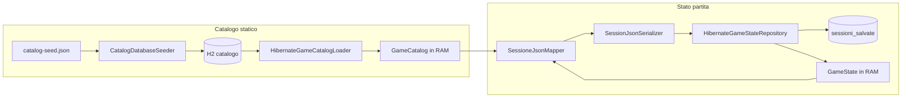
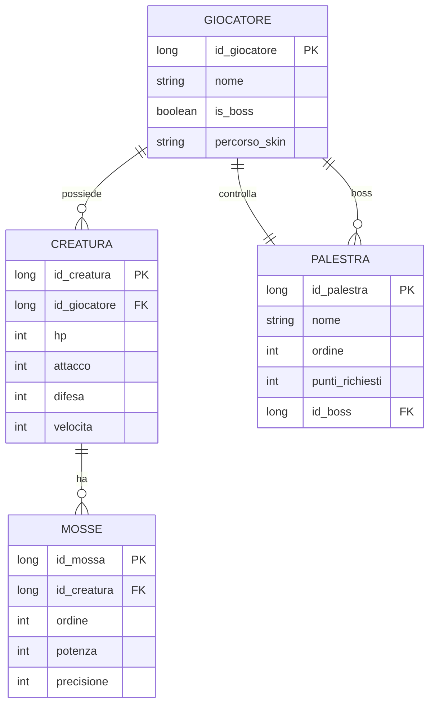
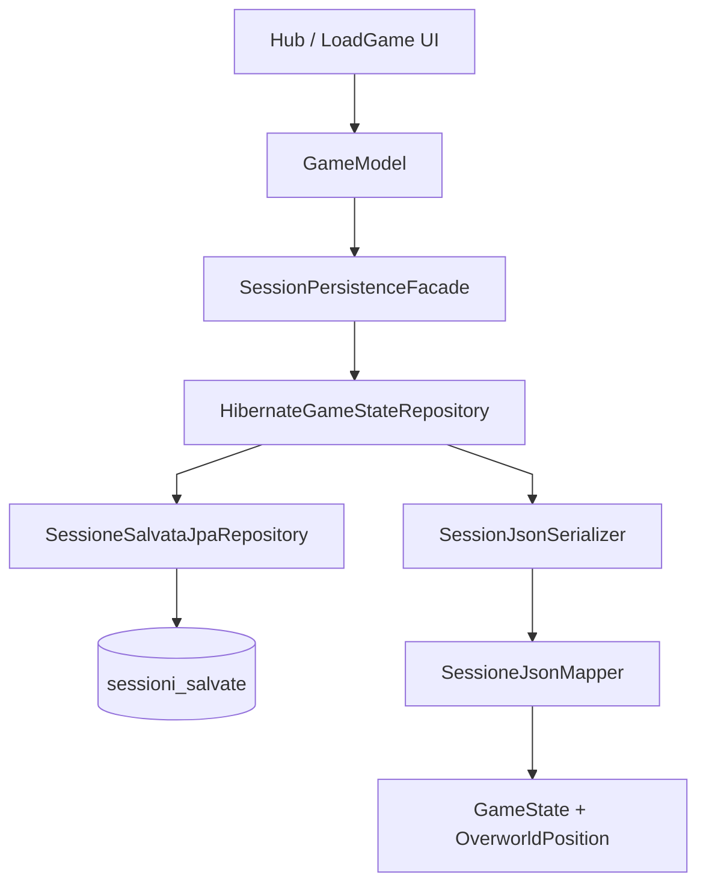

# Dati e persistenza

← [Home](https://github.com/ValerioGiglio04/rpg-MPGC/wiki/Home) · [Architettura](https://github.com/ValerioGiglio04/rpg-MPGC/wiki/Responsabilita-e-architettura)

Ho separato **catalogo statico** e **stato di partita**: il primo in tabelle H2 normalizzate, il secondo in JSON per slot. Stesso file database, due ruoli distinti.

---

## Panoramica

| Ambito | Contenuto | Dove | Mutabilità in partita |
|--------|-----------|------|------------------------|
| **Catalogo** | Template creature, mosse, palestre, boss | H2 + `GameCatalog` in RAM | Solo lettura |
| **Salvataggio** | Gloria, team (id + HP), palestre completate, posizione mappa | Riga in `sessioni_salvate` | Aggiornato a ogni save manuale |

---

## Identificatori numerici

Uso `long` ovunque: dominio (`Creature.catalogId`, `GymRoom.id`), seed JSON, JSON di sessione e PK H2. Niente mappe codice ↔ id duplicate.

---

## Catalogo vs sessione

Il **catalogo** viene letto da `catalog-seed.json` all'avvio (`CatalogSeedJsonLoader`), scritto su H2 da `CatalogDatabaseSeeder` se mancano dati, e caricato in RAM come `GameCatalog` da `HibernateGameCatalogLoader`.

Lo **stato di partita** vive in memoria come `GameState` (`GameStateHolder`) e si persiste su richiesta dell'utente: `SessionPersistenceFacade` → `HibernateGameStateRepository` → colonna `dati_salvati_json`.

Al **load**, `SessioneJsonMapper.fromDto()` reidrata nomi, mosse e statistiche base dal catalogo usando gli `id` salvati nel JSON.



---

## Configurazione e percorso H2

File: `src/main/resources/META-INF/persistence.xml`

- Persistence unit: `rpg-palestre-creature`
- URL: `jdbc:h2:file:~/.rpg-palestre-creature/save;AUTO_SERVER=TRUE`
- Utente/password: `sa` / vuota
- DDL: `hibernate.hbm2ddl.auto = update`

Ispezione database:

```bash
./gradlew h2Console
```

Il file H2 è nella home utente, non nel repository Git.

---

## Tabelle catalogo

| Tabella | Entità | Ruolo |
|---------|--------|--------|
| `giocatore` | `GiocatoreEntity` | Giocatore umano e boss (`is_boss`, skin) |
| `creatura` | `CreaturaEntity` | Statistiche base; `id_giocatore` per creature del boss |
| `mosse` | `MossaEntity` | Mosse per creatura (ordine, potenza, precisione) |
| `palestra` | `PalestraEntity` | Nome, ordine, soglia punti, `id_boss` |

Il team del boss non ha tabella dedicata: le creature hanno `creatura.id_giocatore = palestra.id_boss`.

I **collegamenti** tra palestre non sono in H2: `PalestraCollegamentiSupport` costruisce al load una catena lineare da `ordine` (ogni palestra collegata a `ordine ± 1`).



Lo **stato di partita** non compare in questo diagramma: vive in `sessioni_salvate.dati_salvati_json`.

---

## Porta `GameStateRepository`

Contratto in `model.persistence`, implementazione `HibernateGameStateRepository`:

- `hasAnySave()` — abilita "Carica partita" nel menu
- `listSaves()` — metadati slot per `LoadGame.fxml`
- `save(SaveSessionCommand)` — crea o aggiorna slot
- `load(sessionId)` — restituisce `LoadedSession` (stato + posizione mappa)
- `delete(sessionId)` — rimuove slot
- `markLastPlayed(sessionId)` — flag `ultima_giocata` per il prossimo avvio

JPQL in `SessioneSalvataJpaRepository`; mapping elenco in `SessioneSalvataSummaryMapper`.



---

## Tabella `sessioni_salvate`

| Colonna | Ruolo |
|---------|--------|
| `id_sessione` | Chiave primaria |
| `nome` | Etichetta in UI |
| `data_salvataggio` / `data_creazione` | Timestamp |
| `dati_salvati_json` | Snapshot JSON partita |
| `format_version` | Versione payload per migrazioni future |
| `id_giocatore_catalogo` | Riferimento giocatore umano nel catalogo |
| `id_utente` | Riservato login futuro (`NULL` = salvataggi locali) |
| `ultima_giocata` | Ultimo slot caricato o salvato |

---

## Formato JSON (`dati_salvati_json`)

Radice: `UltimaSessioneSalvataDto`. Campi principali:

| Campo | Significato |
|-------|-------------|
| `num_punti_fama` | Gloria corrente |
| `id_creatura_attiva_selezionata` | `catalogId` creatura attiva |
| `id_palestra_corrente` | Palestra corrente |
| `lista_creature_team_giocatore` | `{ id_creatura, hp }` per ogni slot team |
| `palestre_completate` | `{ id_palestra, completata }` |
| `posizione_giocatore_mappa` | `{ x, y }` sulla griglia overworld |

**Non** si salvano: nomi, mosse, statistiche base, team del boss — reidratati da `GameCatalog` al load.

`SessionJsonSerializer.deserialize()` fa **un solo parse** JSON al load e restituisce `LoadedSessionPayload` (stato + posizione opzionale).

---

## Posizione mappa e layout

Dopo `loadSession`, `GameModel` applica `LoadedSession.overworldPosition()` a `GameStateHolder` e `OverworldMap`. Il layout di palestre e decorazioni è **deterministico** (`OverworldLayoutSupport`, seed `OverworldGridLayout.LAYOUT_SEED = 42`).

---

## Perché JSON nel CLOB

- Payload piccolo (solo progresso e coordinate)
- Aggiornare il seed non invalida i save se gli `id` restano stabili
- Possibile sostituire il backend sessione (cloud, SQL normalizzato) cambiando solo l'adapter — il dominio `GameState` resta invariato

Estensioni future: [Estendibilità](https://github.com/ValerioGiglio04/rpg-MPGC/wiki/Estendibilita).
