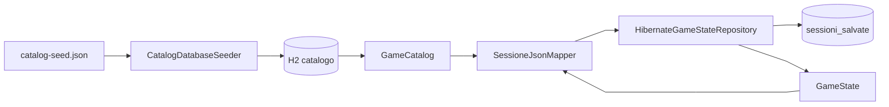

# Dati e persistenza

← [Home](https://github.com/ValerioGiglio04/rpg-MPGC/wiki/Home) · [Architettura](https://github.com/ValerioGiglio04/rpg-MPGC/wiki/Responsabilita-e-architettura)

La specifica chiede di spiegare **organizzazione dei dati** e **come ho garantito la persistenza**. Ho separato due cose:

1. **Catalogo statico** (creature, mosse, palestre, boss) — tabelle H2 normalizzate, letto all'avvio.
2. **Stato di partita** (gloria, HP team, progresso, posizione mappa) — JSON in una colonna, uno slot per save.

Stesso file database H2, due ruoli diversi.

---

## Panoramica

| Dati | Contenuto | Dove | Cambia in partita? |
|------|-----------|------|---------------------|
| Catalogo | Template creature, mosse, palestre | H2 + `GameCatalog` in RAM | No (solo lettura) |
| Sessione | Gloria, HP, palestre completate, coordinate | Riga `sessioni_salvate` | Sì (save manuale) |

Uso **id numerici `long`** ovunque (dominio, JSON, PK H2) per non duplicare mappe codice ↔ id.

---

## Catalogo: da JSON a memoria

1. All'avvio `CatalogSeedJsonLoader` legge `src/main/resources/game-data/catalog-seed.json`.
2. `CatalogDatabaseSeeder` allinea le tabelle H2 se mancano dati (`CatalogBootstrap` in `AppModule`).
3. `HibernateGameCatalogLoader` carica tutto in `GameCatalog` in RAM.

Il giocatore e i boss nel dominio (`Player`, `Creature`) nascono da questi template; in partita cambiano solo HP, gloria, completamento palestre.

---

## Sessione: da GameState a JSON

In memoria lo stato sta in `GameStateHolder`. Quando l'utente salva:

`GameModel.persistSession()` → `SessionPersistenceFacade` → `HibernateGameStateRepository` → colonna `dati_salvati_json`.

Al **load**, `SessioneJsonMapper.fromDto()` ricostruisce `GameState` usando gli **id salvati** e recuperando nomi, mosse e statistiche base dal catalogo.

---

## Configurazione H2

File: `src/main/resources/META-INF/persistence.xml`

- Unit: `rpg-palestre-creature`
- URL: `jdbc:h2:file:~/.rpg-palestre-creature/save;AUTO_SERVER=TRUE`
- User/password: `sa` / vuota
- DDL: `hibernate.hbm2ddl.auto = update`

Il database finisce nella **home utente**, non nel repo Git. Per ispezionarlo: `./gradlew h2Console`.

---

## Tabelle catalogo

| Tabella | Entità JPA | Cosa contiene |
|---------|------------|---------------|
| `giocatore` | `GiocatoreEntity` | Giocatore umano e boss |
| `creatura` | `CreaturaEntity` | Statistiche base; `id_giocatore` le lega al boss |
| `mosse` | `MossaEntity` | Mosse per creatura |
| `palestra` | `PalestraEntity` | Nome, ordine, gloria richiesta, id boss |

I collegamenti tra palestre **non** sono in tabella: li costruisco al load con `PalestraCollegamentiSupport` (catena da campo `ordine`).

---

## Tabella salvataggi `sessioni_salvate`

| Colonna | Uso |
|---------|-----|
| `id_sessione` | PK |
| `nome` | Nome slot in UI |
| `data_salvataggio` / `data_creazione` | Timestamp |
| `dati_salvati_json` | Snapshot partita |
| `format_version` | Per eventuali migrazioni future |
| `id_giocatore_catalogo` | Riferimento giocatore nel catalogo |
| `id_utente` | Riservato login futuro (`NULL` = save locali) |
| `ultima_giocata` | Ultimo slot usato |

Contratto lato codice: interfaccia **`GameStateRepository`** (`listSaves`, `save`, `load`, `delete`, `markLastPlayed`). Implementazione: **`HibernateGameStateRepository`**.

---

## Cosa c'è nel JSON di sessione

Radice: `UltimaSessioneSalvataDto`. Campi principali:

| Campo | Significato |
|-------|-------------|
| `num_punti_fama` | Gloria |
| `id_creatura_attiva_selezionata` | Creatura attiva (id catalogo) |
| `id_palestra_corrente` | Palestra corrente |
| `lista_creature_team_giocatore` | `{ id_creatura, hp }` per slot team |
| `palestre_completate` | `{ id_palestra, completata }` |
| `posizione_giocatore_mappa` | `{ x, y }` sulla griglia |

**Non** salvo nomi, mosse, stats base del boss: al load li riprendo dal catalogo. Così aggiornare il seed non invalida i save se gli id restano gli stessi.

---

## Posizione mappa

Dopo `loadSession`, `GameModel` applica `LoadedSession.overworldPosition()` e la mappa usa `OverworldPlayerSpawn`. Layout palestre/decorazioni sulla griglia è **deterministico** (seed fisso in `OverworldGridLayout`).

---

## Perché JSON nel CLOB

Ho scelto JSON perché il payload è piccolo (solo progresso) e posso cambiare backend sessione in futuro (cloud, SQL normalizzato) implementando un altro `GameStateRepository` senza toccare `GameState`. La colonna `format_version` è già lì per migrazioni.

Estensioni: [Estendibilità](https://github.com/ValerioGiglio04/rpg-MPGC/wiki/Estendibilita).
