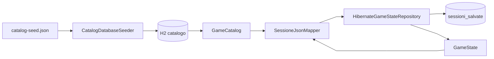
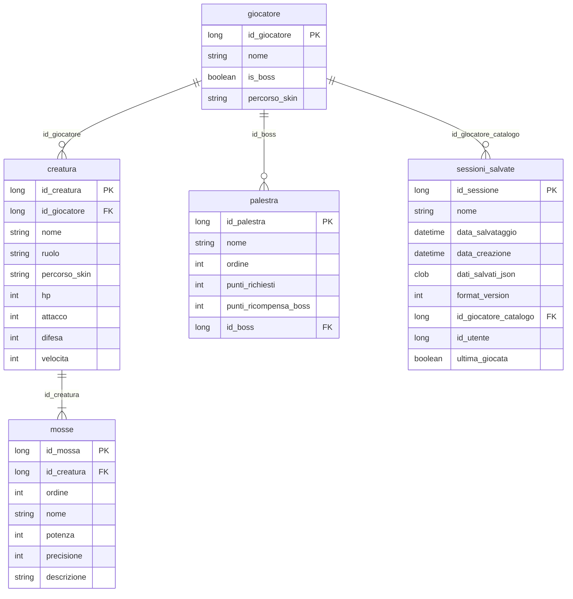

# Dati e persistenza

## Obiettivo

Il sistema di persistenza deve supportare due bisogni distinti:

- mantenere un **catalogo statico** (creature, mosse, palestre, boss) condiviso tra tutte le partite;
- salvare e ripristinare lo **snapshot di partita** (gloria, HP del team, progresso palestre, posizione mappa).

Entrambi i canali usano lo stesso file database H2 locale, ma con ruoli separati: tabelle normalizzate per il catalogo, JSON in colonna CLOB per la sessione.

## Organizzazione dei dati principali

### Dati runtime

Lo stato di gioco in memoria ruota attorno a:

- `GameState` e `GameStateHolder` — aggregato partita corrente;
- `Player`, `Creature`, `GymRoom` — entità di dominio mutate durante il gioco;
- `GameCatalog` — lookup read-only di template statici caricati all'avvio.

### Dati persistiti

| Dati | Contenuto | Dove | Cambia in partita? |
| --- | --- | --- | --- |
| Catalogo | Template creature, mosse, palestre | Tabelle H2 + `GameCatalog` in RAM | No (solo lettura) |
| Sessione | Gloria, HP, palestre completate, coordinate | Riga `sessioni_salvate` | Sì (save manuale) |

Il progetto usa **id numerici `long`** ovunque (dominio, JSON, chiavi H2) per evitare mappe codice ↔ id duplicate.

## Percorsi e configurazione

File: `src/main/resources/META-INF/persistence.xml`

- unità di persistenza: `rpg-palestre-creature`;
- URL JDBC: `jdbc:h2:file:~/.rpg-palestre-creature/save;AUTO_SERVER=TRUE`;
- credenziali: `sa` / password vuota;
- DDL: `hibernate.hbm2ddl.auto = update`.

Il database risiede nella **home utente**, non nel repository Git. Per ispezionare le tabelle: `./gradlew h2Console`.

Seed catalogo: `src/main/resources/game-data/catalog-seed.json`.

## Catalogo: da JSON a memoria

1. All'avvio `CatalogSeedJsonLoader` legge `catalog-seed.json`.
2. `CatalogDatabaseSeeder` allinea le tabelle H2 se mancano dati (`CatalogBootstrap` in `AppModule`).
3. `HibernateGameCatalogLoader` carica tutto in `GameCatalog` in RAM.

Le creature e i boss nel dominio (`Player`, `Creature`) nascono da questi template; in partita cambiano solo HP, gloria e completamento palestre.

## Come viene salvata una partita

Il percorso è il seguente:

1. L'utente invoca il salvataggio dall'hub (`GameModel.persistSession()`).
2. `SessionPersistenceFacade` riceve il comando con nome slot e stato corrente.
3. `SessioneJsonMapper` trasforma `GameState` e posizione mappa in DTO serializzabile.
4. `HibernateGameStateRepository` scrive o aggiorna la riga in `sessioni_salvate`.
5. Il payload JSON viene memorizzato nella colonna `dati_salvati_json`; i metadati (nome, timestamp, `format_version`) restano in colonne dedicate.

## Come viene caricata una partita

1. L'utente seleziona uno slot dalla schermata di caricamento.
2. `GameStateRepository.load()` recupera la riga e deserializza il JSON.
3. `SessioneJsonMapper.fromDto()` ricostruisce `GameState` usando gli **id salvati** e recuperando nomi, mosse e statistiche base dal catalogo.
4. `GameModel` applica `LoadedSession.overworldPosition()` per ripristinare le coordinate sulla griglia.
5. La mappa usa `OverworldPlayerSpawn` e layout deterministico (`OverworldGridLayout`) per posizionare palestre e decorazioni.

In caso di JSON non valido o id assenti dal catalogo, il caricamento fallisce con messaggio in UI e la navigazione resta al menù.

## Struttura JSON di sessione

Radice: `UltimaSessioneSalvataDto`. Campi principali:

| Campo | Significato |
| --- | --- |
| `num_punti_fama` | Gloria del giocatore |
| `id_creatura_attiva_selezionata` | Creatura attiva (id catalogo) |
| `id_palestra_corrente` | Palestra corrente |
| `lista_creature_team_giocatore` | `{ id_creatura, hp }` per slot team |
| `palestre_completate` | `{ id_palestra, completata }` |
| `posizione_giocatore_mappa` | `{ x, y }` sulla griglia |

Non vengono salvati nomi, mosse o statistiche base del boss: al load vengono recuperati dal catalogo. Aggiornare il seed non invalida i save se gli id restano invariati.

## Tabelle catalogo

| Tabella | Entità JPA | Contenuto |
| --- | --- | --- |
| `giocatore` | `GiocatoreEntity` | Giocatore umano e boss |
| `creatura` | `CreaturaEntity` | Statistiche base; `id_giocatore` le lega al boss |
| `mosse` | `MossaEntity` | Mosse per creatura |
| `palestra` | `PalestraEntity` | Nome, ordine, gloria richiesta, id boss |

I collegamenti tra palestre non sono in tabella: vengono costruiti al load con `PalestraCollegamentiSupport` (catena da campo `ordine`).

## Schema del database

Il diagramma seguente riassume le tabelle H2 e i riferimenti logici tra chiavi (`FK` non modellate come associazioni JPA, ma rispettate dal seed e dal mapper).

**Note sullo schema**

- **Catalogo** — quattro tabelle normalizzate; le creature del team umano possono avere `id_giocatore` nullo, mentre quelle dei boss puntano al giocatore boss.
- **Sessione** — una riga per slot; lo stato di partita (HP, gloria, progresso, posizione mappa) è nel CLOB `dati_salvati_json`, non in tabelle figlie.
- **Collegamenti palestre** — assenti nel DB; derivati a runtime dal campo `ordine` di `palestra`.

## Tabella salvataggi `sessioni_salvate`

| Colonna | Uso |
| --- | --- |
| `id_sessione` | Chiave primaria |
| `nome` | Nome slot in UI |
| `data_salvataggio` / `data_creazione` | Timestamp |
| `dati_salvati_json` | Snapshot partita |
| `format_version` | Versione formato per migrazioni future |
| `id_giocatore_catalogo` | Riferimento giocatore nel catalogo |
| `id_utente` | Riservato login futuro (`NULL` = save locali) |
| `ultima_giocata` | Ultimo slot usato |

Contratto lato codice: interfaccia **`GameStateRepository`** (`listSaves`, `save`, `load`, `delete`, `markLastPlayed`). Implementazione: **`HibernateGameStateRepository`**.

## Scelte intenzionali

**JSON nel CLOB** — il payload è piccolo (solo progresso) e consente di sostituire il backend sessione (cloud, SQL normalizzato) implementando un altro `GameStateRepository` senza modificare `GameState`.

**`format_version`** — campo già presente per eventuali migrazioni del formato JSON.

**Id numerici condivisi** — dominio, JSON e PK H2 usano gli stessi `long`, riducendo conversioni e mappe parallele.

**Posizione mappa nel JSON** — dopo il load, `GameModel` applica le coordinate e la griglia mantiene layout deterministico indipendente dal save.

Estensioni future: [Estendibilità](Estendibilita).
