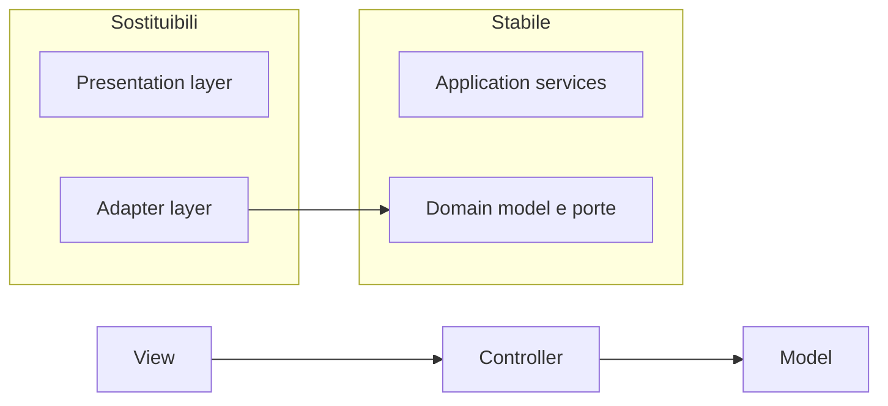
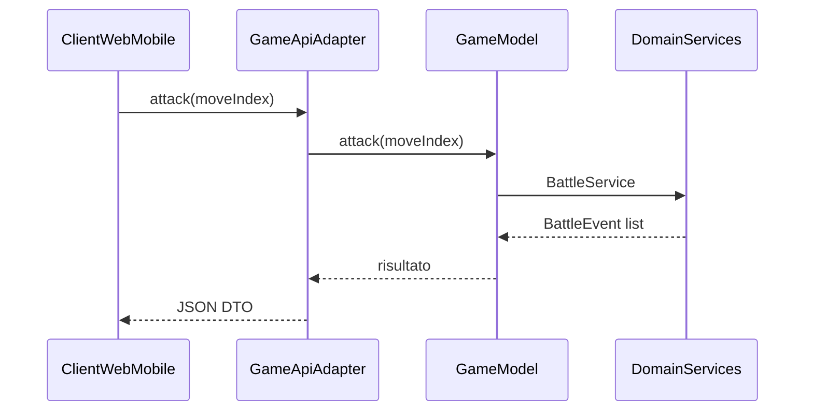
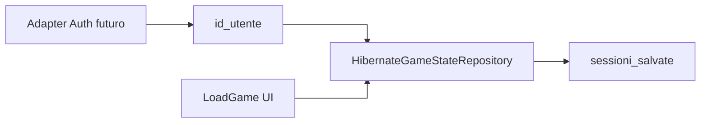
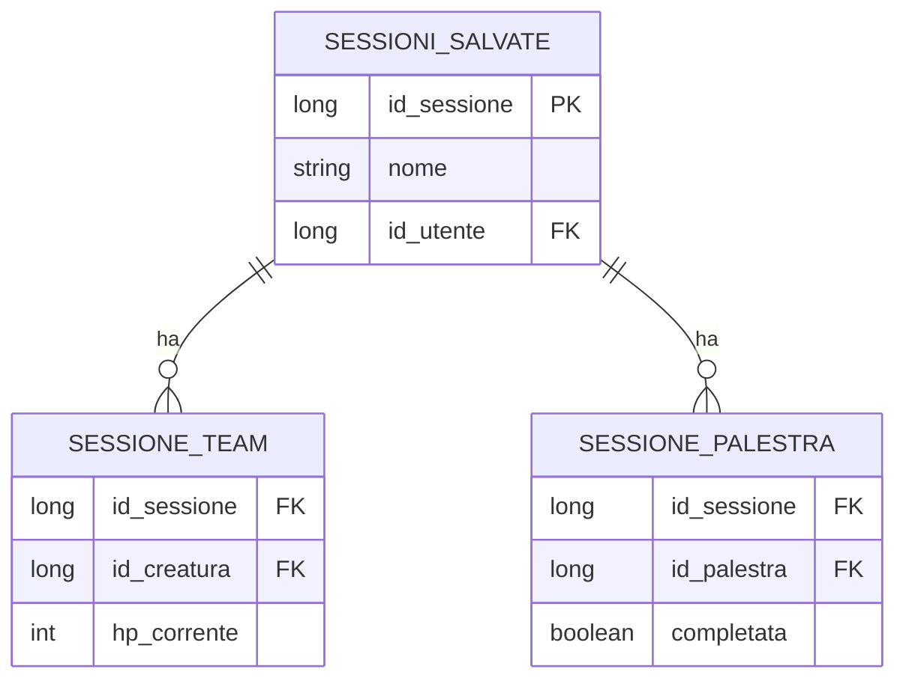

# Estendibilità

> [← Indice Wiki](https://github.com/ValerioGiglio04/rpg-MPGC/wiki/Home) · [Architettura](https://github.com/ValerioGiglio04/rpg-MPGC/wiki/Responsabilita-e-architettura) · [Funzionalità](https://github.com/ValerioGiglio04/rpg-MPGC/wiki/Funzionalita-implementate) · [Persistenza](https://github.com/ValerioGiglio04/rpg-MPGC/wiki/Dati-e-persistenza)

La specifica del corso richiede che il progetto sia progettato per **future estensioni** (nuove funzionalità, altri dispositivi) anche se non tutto è presente nella prima release. Questa pagina descrive i **meccanismi già presenti nel codice** per integrare evoluzioni senza riscrivere il nucleo.

---

## Principio generale

> Alcuni grafici Mermaid (flowchart e `erDiagram`) sono stati abbozzati con **ChatGPT / Claude** e poi integrati da me ([dettaglio](https://github.com/ValerioGiglio04/rpg-MPGC/wiki/Dichiarazione-AI#grafici-mermaid-nella-wiki-chatgpt-e-claude)).



- **Stabile:** dominio + casi d'uso (`model.service`).
- **Sostituibile:** UI (`view`) e implementazioni concrete (`model.persistence`).

---

## Nuova interfaccia utente (web, mobile, altro desktop)

| Passo | Azione |
|-------|--------|
| 1 | Creare un nuovo package presentation (es. `ui.web` o modulo separato) |
| 2 | Chiamare **solo** `GameModel` (o estrarre un'interfaccia `GameApi` con gli stessi metodi) |
| 3 | Non importare Hibernate, entità JPA o classi JavaFX nel nuovo layer |
| 4 | Opzionale: esporre `GameModel` tramite controller REST che serializzano DTO |

**Esempio futuro:** client React che invoca `POST /battle/attack?moveIndex=0` implementato da un model.persistence Spring che delega a `BattleService`.

Il dominio e le regole di `canChallengeGym`, danno, gloria restano **identici**.



---

## Nuovo backend di persistenza

| Passo | Azione |
|-------|--------|
| 1 | Implementare `GameStateRepository` in `model.persistence.session` (JPQL in `SessioneSalvataJpaRepository` o equivalente, mapper in `session.mapper`, DTO in `session.dto`) |
| 2 | Opzionale: implementare `GameCatalogLoader` in `model.persistence.catalog` (seed in `catalog.seed`, mapping in `catalog.mapper`) se il catalogo non resta su H2 |
| 3 | Registrare le implementazioni in `AppModule` (composition root); contratti in `model.persistence` |

**Oggi:** `HibernateGameStateRepository` orchestra il salvataggio su `sessioni_salvate` (colonna `dati_salvati_json`), delegando JPQL a `SessioneSalvataJpaRepository` e l'elenco slot a `SessioneSalvataSummaryMapper`. La UI elenca gli slot in `LoadGame.fxml` e carica con `GameModel.loadSession(id)`.

**Esempi futuri:** PostgreSQL cloud, API REST, sincronizzazione account.

Il contratto `GameStateRepository` isola la UI dal dettaglio JPA/JSON.

---

## Nuove regole di combattimento

| Estensione | Meccanismo |
|------------|------------|
| Danni diversi, status, critici | Nuova classe che implementa `AttackResolutionStrategy` |
| IA boss diversa | Nuova classe `BossMoveStrategy` |
| Eventi aggiuntivi | Nuovi record in `BattleEvent` (sealed) + aggiornamento `BattleEventTranslator` |

Wiring in `AppModule`:

```java
import it.unicam.cs.mpgc.rpg125664.model.combat.strategy.AttackResolutionStrategy;
import it.unicam.cs.mpgc.rpg125664.model.combat.strategy.BossMoveStrategy;
import it.unicam.cs.mpgc.rpg125664.model.combat.strategy.implementations.AccuracyThresholdBossMoveStrategy;
import it.unicam.cs.mpgc.rpg125664.model.combat.strategy.implementations.TurnBasedAttackResolutionStrategy;

AttackResolutionStrategy attackResolution = new TurnBasedAttackResolutionStrategy();
BossMoveStrategy bossMoveStrategy = new AccuracyThresholdBossMoveStrategy();
BattleRoundExecutor roundExecutor = new BattleRoundExecutor(attackResolution, bossMoveStrategy);
// Sostituibili con altre implementazioni senza toccare BattleService
```

Nuova policy overworld: implementare `GymStatusStrategy` in `model.overworld.strategy.implementations` e registrarla in `AppModule`.

---

## Nuove creature, palestre, mosse

| Passo | Azione |
|-------|--------|
| 1 | Aggiornare `catalog-seed.json` |
| 2 | Riavviare l'app: `AppModule.bootstrap()` legge il JSON **una volta** (`catalog.seed.CatalogSeedJsonLoader`), il seeder (`catalog.seed.CatalogDatabaseSeeder`) riallinea H2 e `HibernateGameCatalogLoader` usa H2 + `NewGameSettings` già in memoria |
| 3 | Mapping entità → dominio in `CatalogEntityMapper` (`model.persistence.catalog.mapper`); nessuna modifica obbligatoria al dominio se i template rispettano i validator esistenti |

Per logiche speciali (nuovo tipo di palestra) si possono estendere `GymTemplate` / `GymRoom` o introdurre policy nel dominio senza toccare la UI.

---

## Nuove funzionalità di gioco

| Feature futura | Punto di integrazione suggerito |
|----------------|--------------------------------|
| Inventario oggetti | Nuovo servizio in `model.service` + modello in `model` |
| Più slot di salvataggio | **Già presente** via `sessioni_salvate`; estendere con limite slot, autosave, cloud |
| Autosave | Chiamare `GameModel.saveCurrent()` da listener di navigazione o da un futuro `SessionPersistenceCoordinator` (oggi solo save manuale dall'Hub) |
| Achievement | Listener su `BattleEvent` o hook in `GymCompletionHandler` |
| Audio / effetti | Solo layer `ui`, nessun impatto su dominio |
| Negozio | Nuovo caso d'uso + schermata FXML + metodo in `ScreenFactory` e routing in `ScreenNavigator` |

---

## Nuove schermate JavaFX

Pattern consigliato (come hub, battaglia, overworld):

1. Aggiungere `NuovaSchermata.fxml` in `src/main/resources/fxml/`
2. Creare `NuovaSchermataController` in `controller` (stato + comandi verso `GameModel`)
3. Creare `NuovaSchermataController` sottile: binding FXML + delega al controller
4. Registrare transizione in `navigation.implementations.ScreenNavigator` (policy) e costruzione schermata in `navigation.support.ScreenFactory`
5. Eventuale interfaccia callback in `controller.navigation` + implementazione in `actions.implementations` (delega a `ScreenNavigation`)
6. Errori utente via `UiErrorReporter`; dialoghi via `DialogHelper`

---

## Lingua dell'interfaccia (file di traduzione)

L'UI **non** incolla stringhe fisse nei controller: menu, hub, duello, dialoghi e messaggi di errore passano da un unico bundle di risorse. Per questo **cambiare lingua o riscrivere i testi** non richiede di modificare la logica di gioco.

| Elemento | Ruolo |
|----------|--------|
| `src/main/resources/i18n/messages_it.properties` | File delle traduzioni (chiave → testo) usato nella v1 in italiano |
| `Messages` (`view.support`) | Punto unico per `get` / `format` e per il `ResourceBundle` condiviso con FXML |
| `FxmlScreenLoader` (`controller.navigation`) | Passa lo stesso bundle a `FXMLLoader`, così i `%chiave` negli `.fxml` risolvono le stesse stringhe |
| Controller Java | Usano `Messages.get("…")` e `Messages.format("…", argomenti)` per etichette dinamiche, log di battaglia, tooltip |

**Modificare solo l'italiano:** editare `messages_it.properties` (es. `menu.start`, `battle.dialog.victory.title`). Placeholder come `{0}` e `{1}` vanno lasciati dove servono a `MessageFormat`.

**Aggiungere un'altra lingua (es. inglese):**

| Passo | Azione |
|-------|--------|
| 1 | Creare `messages_en.properties` nella stessa cartella `i18n/` con le stesse chiavi |
| 2 | All'avvio (es. in `AppModule` o `Main`), chiamare `Messages.setLocale(Locale.ENGLISH)` prima di costruire la UI |
| 3 | Riavviare l'app: FXML e controller useranno il nuovo bundle senza altre modifiche |

```java
// Esempio: lingua inglese all'avvio
Messages.setLocale(Locale.ENGLISH);
```

**Nota:** nomi di creature, mosse e descrizioni in duello provengono dal **catalogo** (`catalog-seed.json` → H2), non da `messages_*.properties`. Per localizzare anche quelli si aggiorna il seed (o, in futuro, colonne/JSON multilingua nel catalogo) — la UI del menu e dei pannelli resta comunque estendibile solo via file di traduzione.

---

## Validazione e integrità

Nuovi aggregati devono:

- Costruzione sempre via `*Builder`: crea l'istanza, poi `Validator<T> v = ValidatorFactory.get{Type}Validator(); v.validate(instance)`
- Rispettare `Rules` (`model.validation`) dove applicabile
- Nuovo tipo: `{Type}Validator extends Validator<T>` in `validation.implementations`, registrazione in `validation.support.ValidatorFactory`; costruttori senza validazione

Questo evita che estensioni introducano stati illegali difficili da debuggare.

---

## Login utente e salvataggi per account

Oggi tutti i salvataggi locali hanno `id_utente IS NULL` in `sessioni_salvate`. In una **futura implementazione con login**:

1. Dopo l'autenticazione, l'model.persistence auth fornisce `userId` all'applicazione (non al dominio).
2. `SessioneSalvataJpaRepository` (filtro slot) e `HibernateGameStateRepository` usano `WHERE id_utente = :userId` in `listSaves` / `save` / `load` al posto del filtro locale `s.idUtente is null`.
3. Ogni utente vede solo le proprie partite nella schermata Carica.
4. Vincolo consigliato: `UNIQUE (id_utente, nome)` per evitare omonimie nello stesso account.



L'autenticazione resta fuori dal dominio: nuovo model.persistence + parametri nel repository, `GameModel` invariato nel contratto verso la UI.

---

## JSON in CLOB vs schema SQL normalizzato

Salviamo `dati_salvati_json` per semplicità (snapshot = `UltimaSessioneSalvataDto`). In SQL “più proprio” si modellerebbero tabelle dedicate:



Il dominio (`GameState`) non cambierebbe; solo l'model.persistence mapperbbe righe SQL ↔ aggregati. Il CLOB potrebbe restare come backup o essere rimosso dopo la migrazione.

| Evoluzione | Come si innesta |
|------------|-----------------|
| **Normalizzazione SQL** | Tabelle `sessione_*`; nuovo mapper in `model.persistence.session` |
| **NoSQL** | MongoDB/Redis con lo stesso DTO documentale; catalogo può restare su H2 |
| **Cloud sync** | REST che espone JSON o righe normalizzate |

---

## Versioning del salvataggio

Il payload in `dati_salvati_json` usa `@JsonIgnoreProperties(ignoreUnknown = true)` sui DTO (`session.dto`). La colonna `format_version` su `sessioni_salvate` permette migrazioni in `SessioneJsonMapper` (`session.mapper`) quando la forma del JSON cambia in modo strutturale.

---

## Cosa non è obbligatorio nella v1

La specifica sottolinea che **non tutte** le funzionalità devono essere nella prima release. L'importante è che il percorso di integrazione sia chiaro:

- Porte (`model.persistence`: `GameStateRepository`, `GameCatalogLoader`) e Strategy (`model.combat.strategy`, `model.overworld.strategy`)
- Facade (`GameModel`, `SessionPersistenceFacade`)
- Controller UI (`*Controller`) separati dai controller FXML
- Composition root (`AppModule` con `bootstrap()` e `create()` per wiring esplicito)
- Catalogo: seed JSON una volta + H2; sessioni in `sessioni_salvate` (JSON in CLOB)
- Coordinate overworld solo come `OverworldPosition` (dominio), mai tipi UI in model.service/model.persistence

Questi elementi documentano **come** il progetto può crescere senza diventare un monolite inseparabile.
