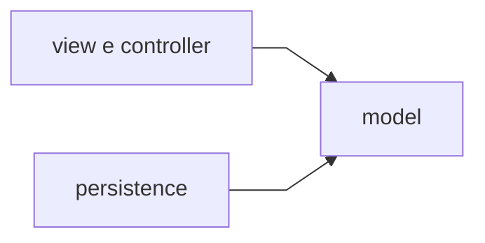

# Estendibilità

## Obiettivo

Il progetto è organizzato per rendere l'aggiunta di nuove funzionalità il più possibile locale, evitando modifiche diffuse in tutto il codice.

Il package `model` (regole, entità, servizi) resta stabile; la UI (`view` e `controller`) e la persistenza concreta (`model.persistence`) sono sostituibili. L'attuale client è JavaFX desktop; client web o mobile possono riusare `GameModel` senza importare Hibernate o JavaFX.

## Meccanismi già disponibili

### 1. API applicativa e client multi-dispositivo

`GameModel` espone operazioni di gioco (nuova partita, battaglia, cura, save/load, consultazione mappa) come facciata unica verso il frontend.

Un nuovo client (REST, mobile, …) può:

1. invocare `GameModel` o un wrapper sopra di esso;
2. evitare import di classi JavaFX o entity JPA;
3. mantenere invariate regole come `canChallengeGym`, calcolo danno e progressione gloria.

### 2. Repository di sessione

La persistenza multi-slot è astratta tramite `GameStateRepository`.

Per introdurre PostgreSQL, sync cloud o salvataggi cifrati:

1. implementare una nuova classe che rispetta il contratto;
2. registrarla in `AppModule` / `ServiceGraph` al posto di `HibernateGameStateRepository`;
3. lasciare invariati controller e `GameModel`.

### 3. Strategy di combattimento e overworld

Interfacce come `AttackResolutionStrategy`, `BossMoveStrategy` e `GymStatusStrategy` incapsulano algoritmi intercambiabili.

| Estensione | Interfaccia | Dove collegarla |
| --- | --- | --- |
| Nuovo calcolo danno o critici | `AttackResolutionStrategy` | `ServiceGraph` |
| IA boss diversa | `BossMoveStrategy` | `ServiceGraph` |
| Logica stato palestre mappa | `GymStatusStrategy` | `ServiceGraph` |
| Nuovo tipo evento in log | Record in `BattleEvent` | `BattleEventTranslator` |

### 4. Interfacce di navigazione per schermata

`MainMenuActions`, `HubActions`, `LoadGameActions`, `*Navigation` segregano le callback UI.

Aggiungere una schermata non richiede di esporre l'intera API di `ScreenNavigator` a ogni controller.

### 5. Seed catalogo e validator

Nuove creature, palestre o mosse si integrano tramite:

1. modifica di `catalog-seed.json`;
2. allineamento H2 all'avvio (`CatalogDatabaseSeeder`);
3. validazione con `ValidatorFactory` e builder dedicati.

Se i validator accettano i dati, il dominio non richiede altre modifiche strutturali.

### 6. Factory di schermate e componenti UI

`ScreenFactory`, `FxmlPaths` e `HubTeamRowFactory` centralizzano montaggio FXML e righe UI. Una nuova scena JavaFX segue il flusso: FXML → path → controller/presenter → factory → navigator.

## Estensioni future possibili

- **UI** — nuove schermate, skin CSS (`UiTheme`), localizzazione con file `messages_xx.properties`;
- **Persistenza** — backend remoto, autosave, schema SQL normalizzato per sessione;
- **Gameplay** — inventario, negozio, cattura selvatica, nuovi tipi di mossa;
- **Multi-utente** — filtrare `sessioni_salvate` per `id_utente` (colonna già presente);
- **i18n** — seconda lingua UI tramite bundle condiviso e `Messages.setLocale(...)`.

## Cosa non è in v1

Non sono implementati:

- multiplayer o sincronizzazione online;
- client web o mobile;
- inventario, negozio e cattura selvatica;
- autosave automatico (il save è manuale dall'hub);
- login utente (colonna `id_utente` riservata).

I punti di aggancio per integrarli restano `GameModel`, `GameStateRepository` e le strategy registrate in `ServiceGraph`.

Organizzazione layer: [Responsabilità e architettura](Responsabilita-e-architettura).
