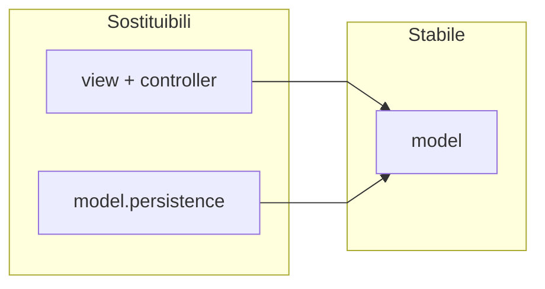

# Estendibilità

← [Home](https://github.com/ValerioGiglio04/rpg-MPGC/wiki/Home) · [Architettura](https://github.com/ValerioGiglio04/rpg-MPGC/wiki/Responsabilita-e-architettura)

La specifica richiede che sia chiaro come il progetto possa crescere (nuove funzionalità, altri dispositivi) anche se non tutto è nella v1. Qui descrivo i **punti di aggancio già presenti** nel codice.

---

## Principio

- **Stabile:** `model` (entità, servizi, regole di gioco)
- **Sostituibile:** `view` + `controller` (JavaFX oggi), implementazioni in `model.persistence`

Oggi c'è solo UI JavaFX. Un client web o mobile dovrebbe chiamare **`GameModel`** (o un'evoluzione tipo `GameApi`) senza importare Hibernate, JPA o JavaFX.

---

## Nuova interfaccia utente

| Passo | Azione |
|-------|--------|
| 1 | Nuovo package presentation (es. `ui.web`) |
| 2 | Chiamare solo `GameModel` |
| 3 | Non importare entità JPA o classi JavaFX |
| 4 | Opzionale: controller REST che serializza DTO |

Il dominio e le regole (`canChallengeGym`, danno, gloria) restano identici.

---

## Nuovo backend di persistenza

| Passo | Azione |
|-------|--------|
| 1 | Implementare `GameStateRepository` in `model.persistence.session` |
| 2 | Opzionale: nuova impl di `GameCatalogLoader` se il catalogo non resta su H2 |
| 3 | Registrare in `AppModule`; contratto in `model.persistence` |

**Oggi:** `HibernateGameStateRepository` salva su `sessioni_salvate` con JSON in CLOB, JPQL in `SessioneSalvataJpaRepository`.

**Futuro:** PostgreSQL, API REST, sync cloud — stesso contratto `GameStateRepository`.

---

## Nuove regole di gioco

| Estensione | Meccanismo |
|------------|------------|
| Danni, critici, status | Nuova `AttackResolutionStrategy` |
| IA boss diversa | Nuova `BossMoveStrategy` |
| Policy overworld | Nuova `GymStatusStrategy` in `model.overworld.strategy.implementations` |
| Eventi battaglia | Nuovi record in `BattleEvent` (sealed) + `BattleEventTranslator` |

Wiring in `AppModule`: sostituire le impl strategy senza modificare `BattleService`.

---

## Nuove creature, palestre, mosse

1. Aggiornare `src/main/resources/game-data/catalog-seed.json`
2. Riavviare: `CatalogDatabaseSeeder` riallinea H2 se serve
3. Mapping in `CatalogEntityMapper`; dominio invariato se i validator accettano i nuovi dati

---

## Nuova schermata JavaFX

1. `NuovaSchermata.fxml` in `src/main/resources/fxml/`
2. Controller in `controller` + componenti in `view`
3. Costruzione in `ScreenFactory`, transizione in `ScreenNavigator`
4. Callback opzionale: `*Actions` + `*ActionsImpl` → `*Navigation`
5. Errori utente via `UiErrorReporter`; dialoghi via `DialogHelper`

---

## Validazione di nuovi aggregati

- Costruzione via `*Builder`, poi `ValidatorFactory.get*Validator().validate(instance)`
- Nuovo tipo: `{Type}Validator extends Validator<T>` in `validation.implementations` + registrazione in `ValidatorFactory`

---

## Lingua dell'interfaccia

- Testi UI: `src/main/resources/i18n/messages_it.properties`
- Accesso centralizzato: `Messages` e `FxmlScreenLoader` (bundle condiviso con FXML)
- Altra lingua: creare `messages_en.properties` con le stesse chiavi + `Messages.setLocale(...)` all'avvio

Nomi di creature e mosse in duello provengono dal **catalogo** (`catalog-seed.json`), non da `messages_*.properties`.

---

## Altre estensioni possibili

- **Autosave** — `GameModel.saveCurrent()` da listener (oggi solo save manuale Hub)
- **Inventario, negozio, achievement** — nuovo servizio in `model.service` + entità in `model.entity`
- **Login multi-utente** — filtrare `sessioni_salvate` per `id_utente` in `model.persistence`; `GameModel` invariato verso i controller
- **Schema SQL normalizzato** — tabelle `sessione_*` + nuovo mapper; `GameState` invariato
- **Versioning JSON** — colonna `format_version` + migrazioni in `SessioneJsonMapper`

Organizzazione layer: [Architettura](https://github.com/ValerioGiglio04/rpg-MPGC/wiki/Responsabilita-e-architettura).
