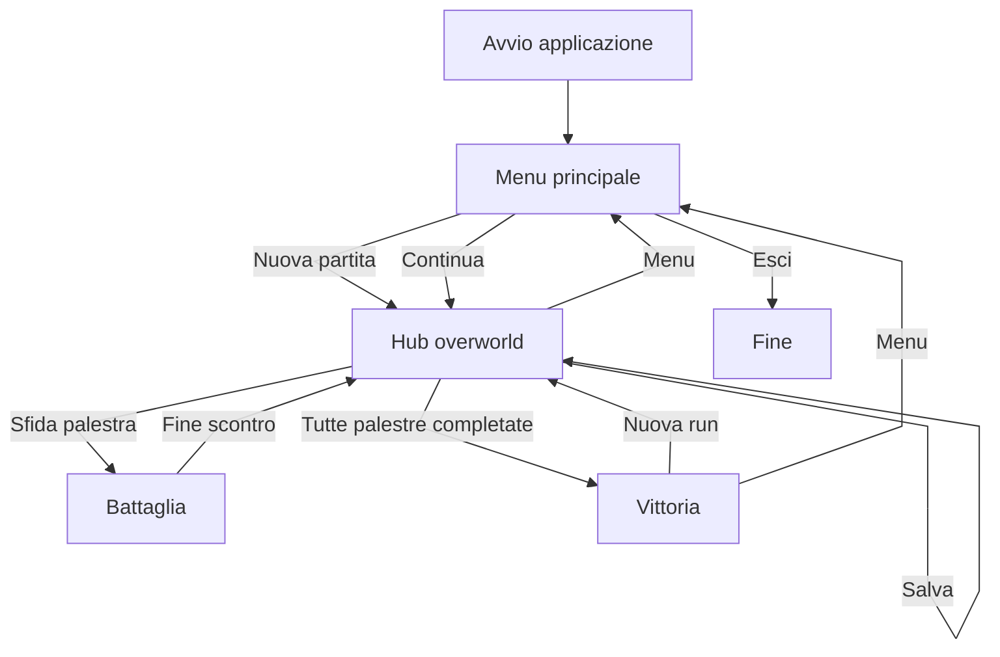

# Funzionalità implementate

← [Home](https://github.com/ValerioGiglio04/rpg-MPGC/wiki/Home) · [Architettura](https://github.com/ValerioGiglio04/rpg-MPGC/wiki/Responsabilita-e-architettura) · [Persistenza](https://github.com/ValerioGiglio04/rpg-MPGC/wiki/Dati-e-persistenza)

Documentazione delle funzionalità presenti nella **prima release**. Feature non implementate (inventario, multiplayer, web) sono descritte in [Estendibilità](https://github.com/ValerioGiglio04/rpg-MPGC/wiki/Estendibilita).

---

## Concept di gioco

- Il giocatore controlla un **team di creature** con statistiche (attacco, difesa, velocità, HP)
- Il mondo è diviso in **palestre collegate**; ogni palestra ha un boss con un proprio team
- Per sfidare un boss serve raggiungere una **soglia minima di gloria** (`requiredPoints` sulla palestra)
- Completare una palestra (tutte le creature del boss KO) assegna **gloria** e può aggiungere le creature del boss al team
- La campagna termina quando **tutte le palestre** risultano completate

---

## Schermate (JavaFX + FXML)

| Schermata | FXML | Controller | Ruolo |
|-----------|------|------------|-------|
| Menu principale | `MainMenu.fxml` | `MainMenuController` | Nuova partita, continua, esci |
| Carica partita | `LoadGame.fxml` | `LoadGameController` | Elenco slot, caricamento ed eliminazione |
| Hub / overworld | `Hub.fxml` | `HubController` | Mappa, team, cura, salvataggio |
| Battaglia | `Battle.fxml` | `BattleController` | Combattimento a turni |
| Vittoria | `Victory.fxml` | `VictoryController` | Campagna completata |

I **controller** interagiscono con `GameModel`: non accedono direttamente a Hibernate né alle entità JPA. Il routing è in `ScreenNavigator`; la costruzione schermate in `ScreenFactory`. I ritratti usano `PortraitAssetResolver` (creato in `AppModule`).

---

## Menu principale

- **Nuova partita:** `NewGameService` costruisce team iniziale e palestre dal catalogo
- **Carica partita:** apre `LoadGame.fxml` con slot da `sessioni_salvate`; pulsante attivo se `hasAnySave()`
- **Esci:** chiusura applicazione

In caso di errore di caricamento viene mostrato un alert e si resta al menu.

---

## Hub (overworld)

- **Mappa a tile** con movimento da tastiera; il giocatore si sposta tra celle con palestre e decorazioni
- **Zoom** con pulsanti +/- e rotella (`OverworldZoomControls`)
- **Stato palestre** (via `GameModel.statusOf` e `GymStatusStrategy`):
  - `COMPLETED` — palestra già completata
  - `AVAILABLE` — sfidabile (raggiungibile + gloria sufficiente)
  - `CURRENT` — palestra in cui si trova il giocatore
  - `NEEDS_POINTS` — raggiungibile ma gloria insufficiente
  - `UNREACHABLE` — non collegata alla posizione corrente
- **Interazione palestra:** modale di conferma (`OverworldGymModalController`); se necessario `moveTo(gymId)` poi avvio battaglia
- **Team:** elenco creature del party; selezione creatura attiva; **cura a pagamento** (costo in gloria proporzionale agli HP mancanti)
- **Menu hamburger:** salvataggio manuale, salva come nuovo, ritorno al menu
- Se tutte le palestre sono completate, l'ingresso all'Hub porta alla schermata **Vittoria**

---

## Combattimento

- **Precondizione:** `GameState.canChallengeGym(gym)` (non completata, raggiungibile, punti sufficienti)
- **Inizio battaglia** (`BattleService.begin`): cura completa di team giocatore e boss per un nuovo tentativo; selezione prima creatura disponibile per entrambi
- **Turno:** il giocatore sceglie una mossa; l'ordine nel round dipende dalla **velocità** delle creature attive
- **Strategy:** `TurnBasedAttackResolutionStrategy` (colpo/danno/miss), `AccuracyThresholdBossMoveStrategy` (mossa del boss)
- **Switch:** cambio creatura attiva nel team del giocatore
- **Eventi:** lista di `BattleEvent` tradotti in italiano per il log (`BattleEventTranslator`)
- **Fine palestra:** KO di tutte le creature del boss → `GymCompletionHandler` marca completata, assegna gloria, aggiunge creature al party
- **Palestre già completate:** modalità revisione senza reset HP all'ingresso

---

## Progressione tra palestre

- Ogni `GymRoom` espone `connectedGymIds`: spostamento solo verso palestre **adiacenti** (`GameState.moveTo`)
- I punti fama del giocatore (`Score`) determinano quali boss sono accessibili
- La palestra corrente è tracciata da `currentGymId` nello stato di gioco

---

## Persistenza in gioco

- **Più slot** in `sessioni_salvate` (partite parallele sulla stessa macchina)
- **Salvataggio manuale** dall'Hub: aggiorna lo slot corrente
- **Salva come nuovo:** crea una nuova riga con nome scelto dall'utente
- **Eliminazione** slot dalla schermata Carica
- Nel JSON: id numerici di catalogo, HP correnti, gloria, progresso palestre, coordinate `{x,y}` — dettaglio in [Persistenza](https://github.com/ValerioGiglio04/rpg-MPGC/wiki/Dati-e-persistenza)

---

## Catalogo e nuova partita

- All'avvio `CatalogDatabaseSeeder` allinea H2 a `catalog-seed.json` se serve
- `NewGameService` costruisce il primo `GameState` da `GameCatalog` e `NewGameSettings`

---

## Internazionalizzazione

Messaggi UI e log di battaglia in italiano tramite `messages_it.properties` e `Messages`. FXML e controller condividono lo stesso bundle via `FxmlScreenLoader`.

---

## Flusso utente

---

## Fuori scope v1

Multiplayer, mobile/web, negozio oggetti, cattura selvatica. Il struttura MVC indicano dove integrarle in futuro.
