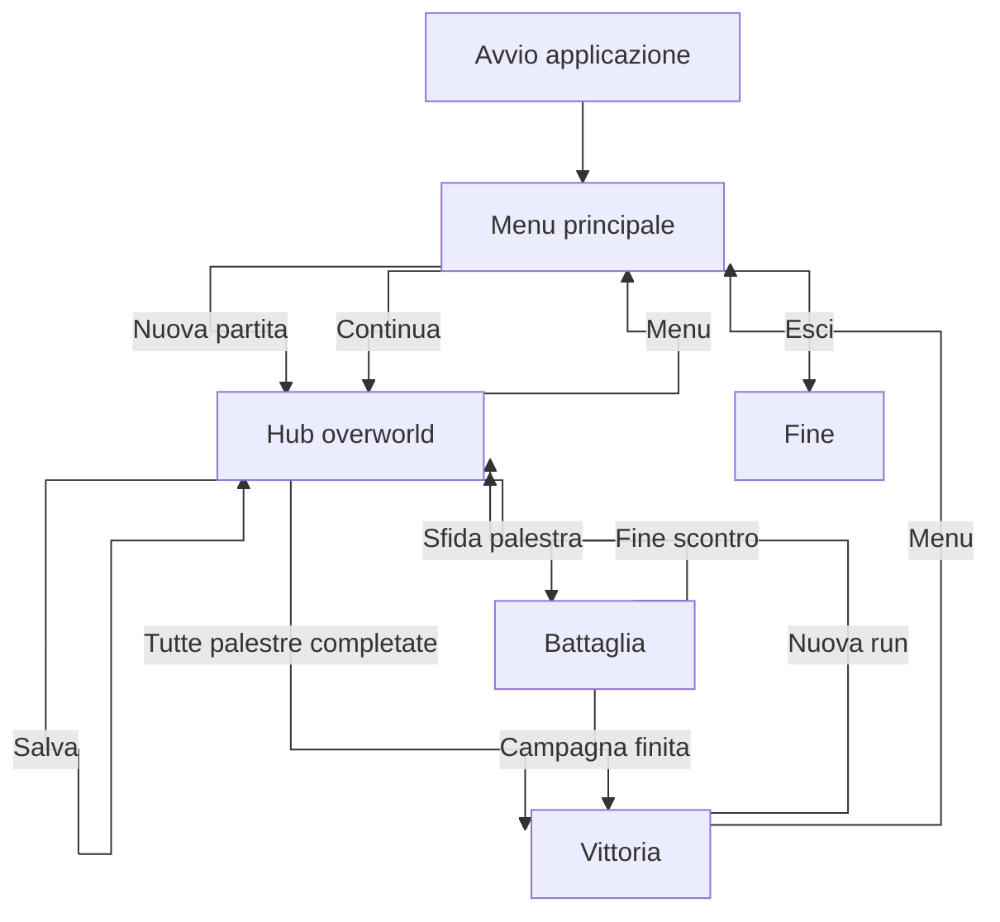

# Funzionalità implementate

> [← Indice Wiki](https://github.com/ValerioGiglio04/rpg-MPGC/wiki/Home) · [Architettura](https://github.com/ValerioGiglio04/rpg-MPGC/wiki/Responsabilita-e-architettura) · [Persistenza](https://github.com/ValerioGiglio04/rpg-MPGC/wiki/Dati-e-persistenza) · [Estendibilità](https://github.com/ValerioGiglio04/rpg-MPGC/wiki/Estendibilita)

Documentazione delle funzionalità presenti nella **prima release** del gioco. Funzionalità non ancora implementate (es. inventario, multiplayer) sono descritte in [Estendibilità](https://github.com/ValerioGiglio04/rpg-MPGC/wiki/Estendibilita) come percorsi di integrazione futura.

---

## Concept di gioco

- Il giocatore controlla un **team di creature** con statistiche (attacco, difesa, velocità, HP).
- Il mondo è diviso in **palestre** collegate tra loro; ogni palestra ha un **boss** con un proprio team.
- Per sfidare un boss serve raggiungere una **soglia minima di punti fama** (`requiredPoints` sulla palestra).
- Completare una palestra (tutte le creature del boss KO) assegna **gloria** e può aggiungere le creature del boss al team del giocatore.
- La campagna termina quando **tutte le palestre** risultano completate.

---

## Schermate (JavaFX + FXML)

| Schermata | FXML | Controller | Ruolo |
|-----------|------|------------|-------|
| Menu principale | `MainMenu.fxml` | `MainMenuController` | Nuova partita, continua, esci |
| Carica partita | `LoadGame.fxml` | `LoadGameController` | Elenco slot, caricamento ed eliminazione |
| Hub / overworld | `Hub.fxml` | `HubController` | Mappa, team, cura, salvataggio |
| Battaglia | `Battle.fxml` | `BattleController` | Combattimento a turni |
| Vittoria | `Victory.fxml` | `VictoryController` | Campagna completata |

Navigazione e routing: `controller.navigation` (`ScreenNavigator`, `FxmlScreenLoader`). Controller caricamento: `LoadGameController`. Callback menu/hub/carica/vittoria: `controller.navigation` + `actions.implementations` (`*ActionsImpl` via `ScreenNavigation`).

La UI interagisce **solo** con `GameModel` (`model.service`): non accede direttamente a Hibernate né alle entità JPA.

---

## Menu principale

- **Nuova partita:** resetta lo stato tramite `NewGameService` (team iniziale e palestre dal catalogo).
- **Carica partita:** apre `LoadGame.fxml` con l'elenco degli slot in `sessioni_salvate`; il pulsante è attivo se `hasAnySave()`. Dalla lista si carica lo slot con `loadSession` (progresso, palestra, posizione mappa).
- **Esci:** chiusura dell'applicazione.

In caso di errore di caricamento viene mostrato un alert e si resta al menu.

---

## Hub (overworld)

- **Mappa a tile** con movimento da tastiera; il giocatore si sposta tra celle che rappresentano palestre e decorazioni.
- **Stato palestre** (calcolato da `GameModel.statusOf` via `GymStatusStrategy` in `model.overworld.strategy`; enum `GymStatus` in `model.overworld`):
  - `COMPLETED` — palestra già completata
  - `AVAILABLE` — sfidabile (raggiungibile + punti sufficienti)
  - `CURRENT` — palestra in cui si trova il giocatore
  - `NEEDS_POINTS` — raggiungibile ma gloria insufficiente
  - `UNREACHABLE` — non collegata alla posizione corrente
- **Interazione con palestra:** modale di conferma; se necessario `moveTo(gymId)` poi avvio battaglia.
- **Team:** elenco creature del party; selezione creatura attiva; **cura a pagamento** (costo in gloria proporzionale agli HP mancanti, con riserva per non bloccare le palestre sfidabili).
- **Menu hamburger:** salvataggio manuale, ritorno al menu principale.
- Se tutte le palestre sono completate, l'ingresso all'Hub porta alla schermata **Vittoria**.

---

## Combattimento

- **Precondizione:** `GameState.canChallengeGym(gym)` (non completata, raggiungibile, punti sufficienti).
- **Inizio battaglia** (`BattleService.begin`): cura completa di team giocatore e boss per un nuovo tentativo; selezione prima creatura disponibile per entrambi i lati.
- **Turno:** il giocatore sceglie una mossa; l'ordine di esecuzione nel round dipende dalla **velocità** delle creature attive.
- **Strategy:** `TurnBasedAttackResolutionStrategy` (`model.combat.strategy.implementations`) risolve colpo/danno/miss; `AccuracyThresholdBossMoveStrategy` sceglie la mossa del boss. Contratti in `model.combat.strategy`.
- **Switch:** cambio creatura attiva nel team del giocatore durante la battaglia.
- **Eventi:** lista di `BattleEvent` (colpo, miss, KO, switch, sconfitta boss, acquisizione creature, wipe del team) tradotti in italiano per il log di battaglia.
- **Fine palestra:** quando tutte le creature del boss sono KO, `GymCompletionHandler` marca la palestra completata, assegna gloria e aggiunge le creature del boss al party.
- **Palestre già completate:** modalità revisione senza reset HP all'ingresso.

---

## Progressione e navigazione tra palestre

- Ogni `GymRoom` espone `connectedGymIds`: il giocatore può spostarsi solo verso palestre **adiacenti** (`GameState.moveTo`).
- I punti fama del giocatore (`Score`) determinano quali boss sono accessibili.
- La palestra **corrente** è tracciata da `currentGymId` nello stato di gioco.

---

## Persistenza in gioco

- **Più slot di salvataggio** in `sessioni_salvate` (più partite in parallelo sulla stessa macchina).
- **Salvataggio manuale** dall'Hub: aggiorna lo slot corrente in `sessioni_salvate`.
- **Salva come nuovo** dall'Hub: crea una nuova riga con nome scelto dall'utente.
- **Eliminazione** di uno slot dalla schermata Carica.
- Nel JSON si salvano **ID numerici di catalogo** (`catalogId` creature e palestre, es. `1`), HP correnti, gloria, progresso palestre e coordinate `{x,y}`; nomi, mosse e statistiche base restano nel catalogo H2 (vedi [Persistenza dei dati](https://github.com/ValerioGiglio04/rpg-MPGC/wiki/Dati-e-persistenza)).

---

## Catalogo e nuova partita

- All'avvio `CatalogDatabaseSeeder` allinea il catalogo H2 a `catalog-seed.json` quando serve; se il DB è già completo non fa nulla.
- `NewGameService` costruisce il primo `GameState` a partire da `GameCatalog` e `NewGameSettings`.

---

## Internazionalizzazione

- Messaggi UI e log di battaglia in italiano tramite `messages_it.properties` e classi `Messages` / `BattleEventTranslator`.

---

## Flusso utente

> Flowchart Mermaid: bozza con **ChatGPT**, rivista da me ([dettaglio](https://github.com/ValerioGiglio04/rpg-MPGC/wiki/Dichiarazione-AI#grafici-mermaid-nella-wiki-chatgpt-e-claude)).

---

## Funzionalità non presenti in questa release

Esempi deliberatamente fuori scope della v1 (ma progettati per essere aggiungibili):

- Multiplayer / rete
- Versione mobile o web
- Negozio oggetti, cattura creature selvatiche

Il struttura MVC rendono comunque esplicito **dove** integrare queste feature in futuro (vedi [Estendibilità](https://github.com/ValerioGiglio04/rpg-MPGC/wiki/Estendibilita)).
