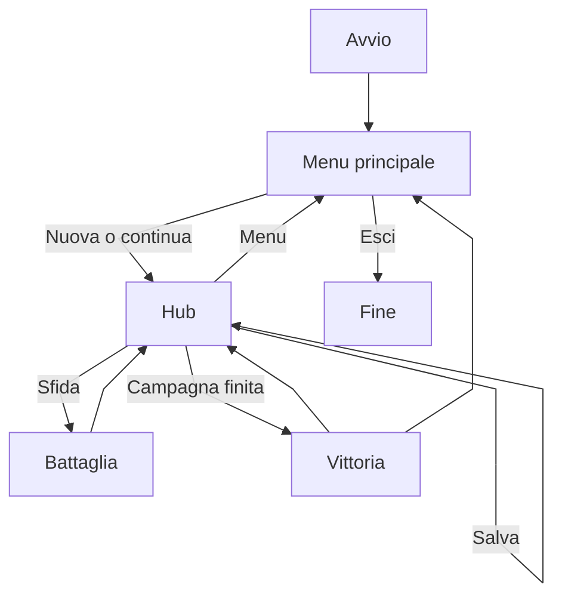

# Funzionalità implementate

← [Home](https://github.com/ValerioGiglio04/rpg-MPGC/wiki/Home) · [Architettura](https://github.com/ValerioGiglio04/rpg-MPGC/wiki/Responsabilita-e-architettura) · [Persistenza](https://github.com/ValerioGiglio04/rpg-MPGC/wiki/Dati-e-persistenza)

Funzionalità presenti nella prima release. Feature fuori scope (inventario, multiplayer, web) sono in [Estendibilità](https://github.com/ValerioGiglio04/rpg-MPGC/wiki/Estendibilita).

---

## Concept di gioco

- Team di creature con attacco, difesa, velocità, HP
- Palestre collegate, ciascuna con boss e soglia minima di punti fama
- Completare una palestra dà gloria e può aggiungere le creature del boss al team
- La campagna finisce quando tutte le palestre sono completate

---

## Schermate

| Schermata | FXML | Controller | Ruolo |
|-----------|------|------------|-------|
| Menu principale | `MainMenu.fxml` | `MainMenuController` | Nuova partita, continua, esci |
| Carica partita | `LoadGame.fxml` | `LoadGameController` | Elenco slot, load, delete |
| Hub / overworld | `Hub.fxml` | `HubController` | Mappa, team, cura, salvataggio |
| Battaglia | `Battle.fxml` | `BattleController` | Combattimento a turni |
| Vittoria | `Victory.fxml` | `VictoryController` | Campagna completata |

La UI usa controller sottili e parla solo con `GameModel`. Il routing è in `ScreenNavigator`; le schermate si costruiscono in `ScreenFactory`.

---

## Menu principale

- **Nuova partita** — `NewGameService` resetta stato e team iniziale
- **Carica partita** — elenco slot da `sessioni_salvate`; attivo se esiste almeno un save
- **Esci** — chiusura app

In caso di errore di load resto al menu con un alert.

---

## Hub (overworld)

- Mappa a tile con movimento da tastiera
- Stato palestre (`GymStatus`): completata, sfidabile, corrente, punti insufficienti, non raggiungibile
- Interazione palestra: modale di conferma; se serve `moveTo(gymId)` poi battaglia
- Team: selezione creatura attiva, cura a pagamento in gloria
- Menu hamburger: save manuale, save as new, ritorno al menu
- Se tutte le palestre sono completate, l'Hub porta alla schermata Vittoria

---

## Combattimento

- Precondizione: `GameState.canChallengeGym(gym)`
- Turni ordinati per velocità; il giocatore sceglie la mossa, il boss con `AccuracyThresholdBossMoveStrategy`
- Danno e miss con `TurnBasedAttackResolutionStrategy`
- Switch creatura durante la battaglia
- Eventi `BattleEvent` tradotti in italiano nel log
- KO di tutte le creature del boss → palestra completata, gloria, creature acquisite
- Palestre già completate: revisione senza reset HP all'ingresso

---

## Persistenza in gioco

- Più slot in `sessioni_salvate`
- Save manuale e "salva come nuovo" dall'Hub
- Eliminazione slot dalla schermata Carica
- Nel JSON: id catalogo, HP, gloria, progresso palestre, coordinate mappa (dettaglio in [Persistenza](https://github.com/ValerioGiglio04/rpg-MPGC/wiki/Dati-e-persistenza))

---

## Flusso utente

---

## Fuori scope v1

Multiplayer, mobile/web, negozio, cattura selvatica. Il design a layer indica dove aggiungerli in futuro.
