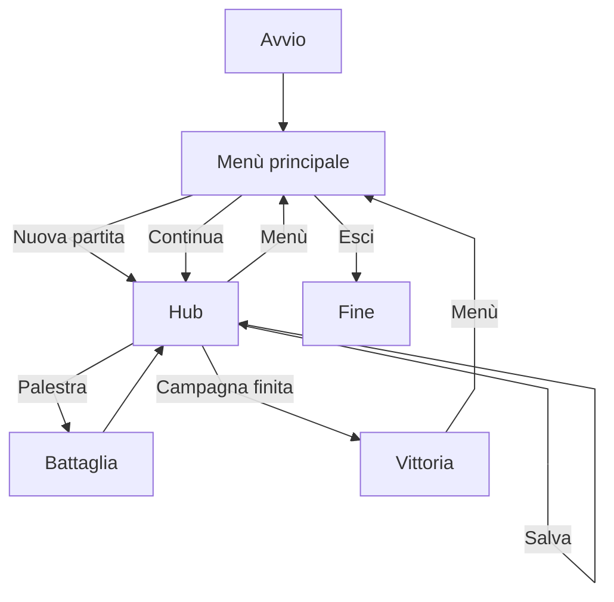

# Funzionalità implementate

## 1. Avvio e navigazione

L'applicazione avvia una finestra desktop JavaFX e utilizza un navigatore centralizzato (`ScreenNavigator`) per cambiare scena senza duplicare la logica di bootstrap.

Funzionalità presenti:

* apertura del menù principale;
* accesso alla schermata di caricamento degli slot;
* ingresso nell'hub con mappa overworld;
* transizione verso il duello in palestra;
* schermata finale di vittoria campagna.

Riferimento tecnico schermate:

| Schermata | FXML | Controller |
| --- | --- | --- |
| Menù principale | `MainMenu.fxml` | `MainMenuController` |
| Carica partita | `LoadGame.fxml` | `LoadGameController` |
| Hub / mappa | `Hub.fxml` | `HubController` |
| Battaglia | `Battle.fxml` | `BattleController` |
| Vittoria | `Victory.fxml` | `VictoryController` |

  

## 2. Gestione della partita

Dal frontend l'utente può:

* iniziare una nuova partita;
* caricare una partita da uno slot esistente;
* salvare la partita corrente dall'hub;
* creare un nuovo slot con "Salva come nuovo";
* eliminare uno slot dalla schermata di caricamento;
* tornare al menù principale.

  

  

In caso di errore di caricamento viene mostrato un messaggio e la navigazione resta al menù.

## 3. Hub e overworld

L'hub è la schermata principale di gioco. Contiene:

* mappa a tile con movimento da tastiera (WASD o frecce);
* zoom con pulsanti +/- e rotella del mouse;
* palestre con stato visivo (corrente, disponibile, completata, bloccata per gloria o per raggiungibilità);
* pannello team con selezione creatura attiva;
* cura a pagamento in gloria, con costo proporzionale agli HP mancanti;
* menù hamburger per salvataggio e ritorno al menù.

  

Interazione con una palestra:

* modale di conferma;
* spostamento automatico verso la palestra se necessario;
* avvio del duello se le condizioni di gioco lo consentono.

Se tutte le palestre risultano completate, l'ingresso nell'hub porta alla schermata di vittoria.

## 4. Combattimento

Il combattimento è gestito a turni: il giocatore sceglie una mossa; l'ordine nel round dipende dalla velocità delle creature attive.

Caratteristiche:

* attacco del giocatore e risposta del boss;
* calcolo danno, miss e KO;
* cambio creatura attiva nel team del giocatore;
* cronaca degli eventi tradotta in italiano nel pannello centrale;
* ricompense al completamento della palestra (gloria e creature del boss nel team).

  

Precondizioni per sfidare un boss:

* palestra non già completata (oppure modalità revisione senza reset HP);
* palestra raggiungibile dalla posizione corrente;
* gloria del giocatore sufficiente rispetto alla soglia della palestra.

## 5. Progressione tra palestre

Il mondo è organizzato in palestre collegate: lo spostamento avviene solo verso palestre adiacenti.

Elementi principali:

* soglia minima di gloria per sfidare ogni boss;
* tracciamento della palestra corrente;
* completamento palestra al KO di tutte le creature del boss;
* vittoria di campagna quando tutte le palestre risultano completate.

## 6. Catalogo e nuova partita

All'avvio il catalogo statico (creature, mosse, palestre, boss) viene allineato da `catalog-seed.json` verso H2 se necessario, poi caricato in memoria.

Una nuova partita costruisce il primo stato di gioco a partire da quel catalogo e dalle impostazioni di default.

## 7. Feedback visivo e internazionalizzazione

Il frontend include:

* legende colore sulle palestre in mappa;
* barre HP e statistiche sulle carte creatura;
* messaggi UI e log di battaglia in italiano tramite bundle condiviso (`messages_it.properties`).

---

## Flusso utente

## Fuori scope della prima release

Multiplayer, client web o mobile, inventario, negozio e cattura selvatica non sono implementati.
I punti di aggancio per integrarli sono descritti in [Estendibilità](Estendibilita).
