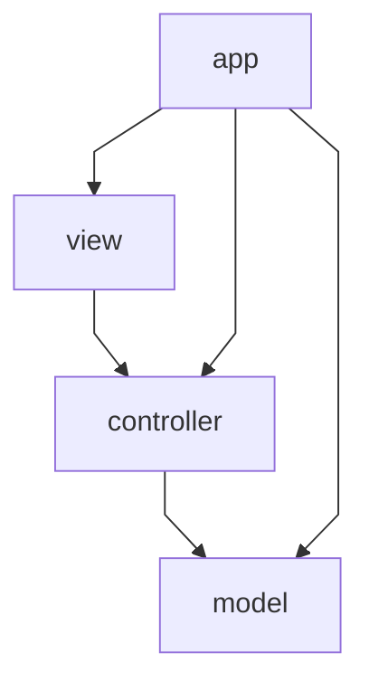

# Responsabilità e architettura

← [Home](https://github.com/ValerioGiglio04/rpg-MPGC/wiki/Home)

Ho organizzato **GymQuest** in **MVC** (Model–View–Controller): il **model** contiene regole di gioco, servizi e persistenza; la **view** espone FXML e componenti JavaFX; i **controller** gestiscono input utente e navigazione verso il model.

---

## Layer e dipendenze



| Layer | Package | Ruolo |
|-------|---------|-------|
| **app** | `...app` | Bootstrap: JPA, seed catalogo, wiring `GameModel`, avvio JavaFX |
| **model** | `...model` | Entità, combattimento, servizi, persistenza H2 — nessuna dipendenza da JavaFX |
| **view** | `...view` | Componenti UI, tema, mappa overworld, FXML in `resources/fxml` |
| **controller** | `...controller` | Controller FXML, navigazione schermate, coordinamento verso `GameModel` |

Le dipendenze vanno **controller → model** e **view → controller** (callback). Il model non importa JavaFX.

---

## Componenti principali

### Model

- **`GameModel`** — facciata usata dai controller: battaglia, cura, save/load, stato mappa
- **`GameState`** — giocatore, palestre, regole `moveTo`, `canChallengeGym`, `allGymsCompleted`
- **`BattleService`** / **`BattleRoundExecutor`** — ciclo battaglia e calcolo turni
- **`NewGameService`**, **`HealingService`**, **`GymCompletionHandler`** — casi d'uso di gioco
- **`model.persistence`** — Hibernate, entità JPA, JSON sessioni, catalogo su H2

### View

- **FXML** (`MainMenu.fxml`, `Hub.fxml`, `Battle.fxml`, …) in `src/main/resources/fxml/`
- **`view.component`** — `CreatureCard`, `BattleArenaView`, `HealthBar`, …
- **`view.overworld`** — `OverworldMap`, tile renderer, modale palestra
- **`view.support`** — `Messages`, `BattleEventTranslator`, caricamento FXML

### Controller

- **`ScreenNavigator`** — flusso tra schermate e dialoghi save/load
- **`ScreenFactory`** — monta FXML + controller
- **Controller FXML** (`HubController`, `BattleController`, …) — gestiscono eventi e aggiornano la view
- **Helper** (`BattlePresenter`, `HubPresenter`, `OverworldPresenter`) — logica schermata estratta dai controller più corposi

### Bootstrap

- **`AppModule`** — crea EMF, catalogo, repository, servizi e **`GameModel`**
- **`RpgApplication`** — avvia JavaFX e passa `GameModel` a `MainView`

---

## Organizzazione package

```
it.unicam.cs.mpgc.rpg125664
├── app/                    Main, RpgApplication, AppModule
├── model/
│   ├── entity/             GameState, Creature, GymRoom, …
│   ├── combat/             BattleRoundExecutor, strategy/
│   ├── catalog/            GameCatalog, template creature
│   ├── service/            GameModel, BattleService, NewGameService, …
│   ├── overworld/          GymStatus, layout mappa
│   ├── persistence/        Hibernate, entità JPA, mapper, seed
│   ├── builder/, validation/, event/, session/
├── view/
│   ├── component/          widget riusabili
│   ├── overworld/          mappa e modale palestra
│   ├── theme/, support/, mapper/
└── controller/
    ├── *Controller.java    controller FXML
    ├── BattlePresenter, HubPresenter, …
    └── navigation/         ScreenNavigator, ScreenFactory, *Actions
```

---

## Flusso tipico (nuova partita → battaglia → save)

### 1. Avvio

1. `Main` → `RpgApplication.start()`
2. `AppModule.bootstrap()` — seed catalogo, crea `GameModel`
3. `MainView` + `ScreenNavigator` → menu principale

### 2. Nuova partita

1. `MainMenuController` → `ScreenNavigator.startNewGame()`
2. `NewGameService` costruisce `GameState` iniziale
3. Navigazione verso Hub

### 3. Hub e battaglia

1. `HubController` legge stato da `GameModel`, monta `OverworldMap`
2. Sfida palestra → `ScreenNavigator.showBattle()`
3. `BattleController` → `GameModel.attack()` → eventi tradotti nel log

### 4. Salvataggio

1. Menu Hub → `ScreenNavigator.saveCurrent()`
2. `GameModel` → `SessionPersistenceFacade` → `HibernateGameStateRepository`

---

## Scelte di design (SOLID nel contesto MVC)

| Principio | Dove nel progetto |
|-----------|-------------------|
| **SRP** | `BattleRoundExecutor` = un round; `BattleController` = UI duello; `GameModel` = API stabile per i controller |
| **OCP** | Nuove strategy in `model.combat.strategy.implementations`; wiring in `AppModule` |
| **DIP** | Controller dipendono da `GameModel`, non da Hibernate; persistenza dietro `GameStateRepository` in `model.persistence` |

Pattern ricorrenti: **Facade** (`GameModel`), **Strategy** (danno, IA boss, stato mappa), **Repository** (salvataggi), **Factory** (`ScreenFactory`).

Vedi anche [Classi e interfacce](https://github.com/ValerioGiglio04/rpg-MPGC/wiki/Classi-e-interfacce) ed [Estendibilità](https://github.com/ValerioGiglio04/rpg-MPGC/wiki/Estendibilita).
