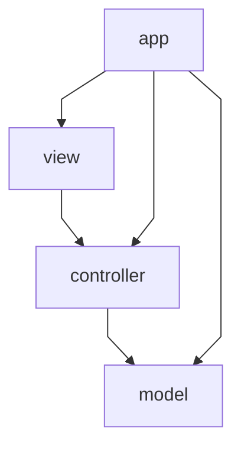
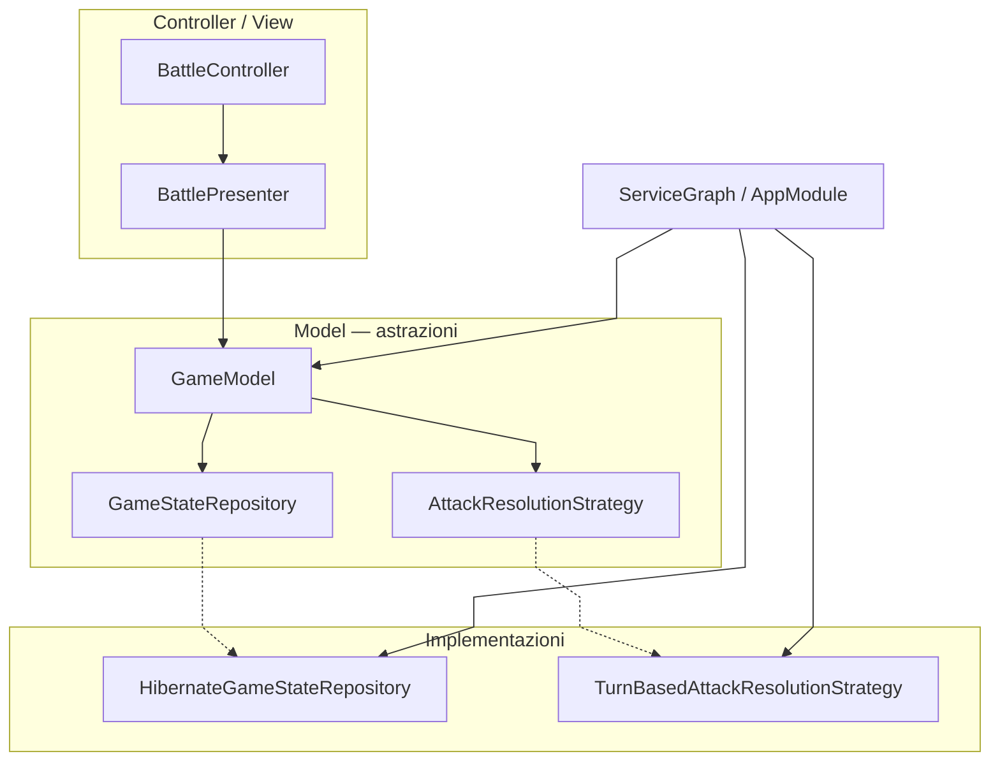

# Responsabilità e architettura

← [Home](https://github.com/ValerioGiglio04/rpg-MPGC/wiki/Home)

Ho organizzato **GymQuest** in **MVC** (Model–View–Controller): il **model** contiene regole di gioco, servizi e persistenza; la **view** espone FXML e componenti JavaFX; i **controller** gestiscono input utente e navigazione verso il model.

---

## Layer e dipendenze



| Layer | Package | Ruolo |
|-------|---------|-------|
| **app** | `...app` | Bootstrap: JPA, seed catalogo, wiring `GameModel`, avvio JavaFX |
| **model** | `...model` | Entità, combattimento, servizi, persistenza H2 — nessuna dipendenza da JavaFX |
| **view** | `...view` | Componenti UI, tema, mappa overworld, FXML in `resources/fxml` |
| **controller** | `...controller` | Controller FXML, navigazione schermate, coordinamento verso `GameModel` |

Le dipendenze vanno **controller → model** e **view → controller** (callback). Il model non importa JavaFX.

---

## Componenti principali

### Model

- **`GameModel`** — facciata usata dai controller: battaglia, cura, save/load, stato mappa
- **`GameState`** — giocatore, palestre, regole `moveTo`, `canChallengeGym`, `allGymsCompleted`
- **`BattleService`** / **`BattleRoundExecutor`** — ciclo battaglia e calcolo turni
- **`NewGameService`**, **`HealingService`**, **`GymCompletionHandler`** — casi d'uso di gioco
- **`model.persistence`** — Hibernate, entità JPA, JSON sessioni, catalogo su H2

### View

- **FXML** (`MainMenu.fxml`, `Hub.fxml`, `Battle.fxml`, …) in `src/main/resources/fxml/`; path Java in `FxmlPaths`
- **`view.component`** — `CreatureCard`, `BattleArenaView`, `HealthBar`, …
- **`view.overworld`** — `OverworldMap`, tile renderer, modale palestra; helper `OverworldPlayerSpawn`, `OverworldMovement`, `OverworldMapChrome`
- **`view.support`** — `Messages`, `BattleEventTranslator`, `BattleSideMessages`, `BattleLogRenderer`, caricamento FXML

### Controller

- **`ScreenNavigator`** (`navigation.implementations`) — flusso tra schermate e dialoghi save/load
- **`ScreenFactory`** — monta FXML + controller via `FxmlPaths`
- **Controller FXML** (`HubController`, `BattleController`, …) — gestiscono eventi e aggiornano la view
- **Presenter** (`BattlePresenter`, `HubPresenter`, `OverworldPresenter`) — logica schermata estratta dai controller
- **Helper UI** — `SavedSessionSummaryCell`, `HubTeamRowFactory`

### Bootstrap

- **`AppModule`** — crea EMF, repository, delega wiring a **`ServiceGraph`**
- **`CatalogBootstrap`** — seed catalogo H2 e caricamento `GameCatalog` all'avvio
- **`ServiceGraph`** — assembla servizi e **`GameModel`**
- **`RpgApplication`** — avvia JavaFX e passa `GameModel` a `MainView`

---

## Organizzazione package

```
it.unicam.cs.mpgc.rpg125664
├── app/                    Main, RpgApplication, AppModule, CatalogBootstrap, ServiceGraph
├── model/
│   ├── entity/             GameState, Creature, GymRoom, …
│   ├── combat/             BattleRoundExecutor, strategy/
│   ├── catalog/            GameCatalog, template creature
│   ├── service/            GameModel, BattleService, NewGameService, GameStateHolder, …
│   ├── overworld/          GymStatus, layout mappa
│   ├── persistence/        Hibernate, entità JPA, mapper, seed
│   ├── builder/, validation/, event/, session/
├── view/
│   ├── component/          widget riusabili
│   ├── overworld/          mappa, spawn/movimento, modale palestra
│   ├── theme/implementations/
│   └── support/, mapper/   Messages, BattleLogRenderer, BattleEventTranslator, …
└── controller/
    ├── *Controller.java    controller FXML
    ├── *Presenter.java     BattlePresenter, HubPresenter, OverworldPresenter
    ├── SavedSessionSummaryCell, HubTeamRowFactory
    └── navigation/         interfacce *Actions/*Navigation
        ├── implementations/  ScreenNavigator, *ActionsImpl
        └── support/          MainView, ScreenFactory, FxmlPaths, …
```

---

## Flusso tipico (nuova partita → battaglia → save)

### 1. Avvio

1. `Main` → `RpgApplication.start()`
2. `AppModule.bootstrap()` — `CatalogBootstrap` (seed + catalogo), poi `ServiceGraph` → `GameModel`
3. `MainView` + `ScreenNavigator` → menu principale

### 2. Nuova partita

1. `MainMenuController` → `ScreenNavigator.startNewGame()`
2. `NewGameService` costruisce `GameState` iniziale
3. Navigazione verso Hub

### 3. Hub e battaglia

1. `HubController` legge stato da `GameModel`, monta `OverworldMap`
2. Sfida palestra → `ScreenNavigator.showBattle()`
3. `BattleController` → `GameModel.attack()` → eventi tradotti nel log (`BattleEventTranslator` + `BattleLogRenderer`)

### 4. Salvataggio

1. Menu Hub → `ScreenNavigator.saveCurrent()`
2. `GameModel` → `SessionPersistenceFacade` → `HibernateGameStateRepository`

---

## Scelte di design (SOLID nel contesto MVC)

I principi **SOLID** guidano come separo responsabilità tra model, view e controller. Non sono etichette astratte: nel codice compaiono come interfacce piccole, classi con un solo motivo di cambiamento e wiring centralizzato in `ServiceGraph`.

### S — Single Responsibility Principle

*Ogni classe ha un solo motivo per cambiare.*

| Classe / componente | Responsabilità unica | Layer MVC |
|---------------------|----------------------|-----------|
| `BattleRoundExecutor` | Esegue **un round** di combattimento (ordine attacchi, KO, swap) | Model |
| `BattleService` | Avvia e chiude una **battaglia** delegando al round executor | Model |
| `BattleController` | Collega input UI (bottoni mosse) alla view del duello | Controller |
| `BattlePresenter` | Stato schermata battaglia: log, turni, messaggi di esito | Controller |
| `BattleEventTranslator` | Traduce `BattleEvent` del model in righe leggibili per la UI | View |
| `SessionPersistenceFacade` | API save/load verso il repository, senza dettagli Hibernate | Model |
| `ScreenFactory` | Carica FXML + controller da `FxmlPaths` | Controller |
| `CatalogBootstrap` | Seed e caricamento catalogo all'avvio | app |

**Esempio concreto:** quando cambio come si calcola il danno, tocco `TurnBasedAttackResolutionStrategy`, non `BattleController`. Quando cambio come si disegna il log, tocco `BattleLogRenderer`, non `GameState`.

---

### O — Open/Closed Principle

*Aperto all'estensione, chiuso alla modifica.*

Aggiungo comportamenti nuovi **implementando** interfacce esistenti o registrando strategy in `ServiceGraph`, senza riscrivere il codice client.

| Estensione | Interfaccia | Implementazione attuale | Dove si collega |
|------------|-------------|-------------------------|-----------------|
| Regole danno / precisione | `AttackResolutionStrategy` | `TurnBasedAttackResolutionStrategy` | `BattleRoundExecutor` |
| IA scelta mossa del boss | `BossMoveStrategy` | `AccuracyThresholdBossMoveStrategy` | `BattleRoundExecutor` |
| Stato visivo palestra sulla mappa | `GymStatusStrategy` | `DefaultGymStatusStrategy` | `GameModel.gymStatus()` |
| Validazione entità | `Validator<T>` | `CreatureValidator`, `MoveValidator`, … | `ValidatorFactory` |
| Skin CSS alternativa | `UiTheme` | `DuelUiTheme` | root FXML battaglia |

**Esempio concreto:** per un boss con IA diversa creo `RandomBossMoveStrategy implements BossMoveStrategy` e in `ServiceGraph.assemble()` sostituisco la riga che istanzia `AccuracyThresholdBossMoveStrategy`. `BattleRoundExecutor` e `BattleService` restano invariati.

---

### L — Liskov Substitution Principle

*Ogni implementazione rispetta il contratto dell'interfaccia e può sostituirla senza rompere i client.*

| Interfaccia | Implementazioni sostituibili | Client che le usa |
|-------------|------------------------------|-------------------|
| `AttackResolutionStrategy` | `TurnBasedAttackResolutionStrategy` (e future varianti) | `BattleRoundExecutor` |
| `BossMoveStrategy` | `AccuracyThresholdBossMoveStrategy` | `BattleRoundExecutor` |
| `GymStatusStrategy` | `DefaultGymStatusStrategy` | `GameModel` |
| `GameStateRepository` | `HibernateGameStateRepository` | `SessionPersistenceFacade` via `AppModule` |
| `GameCatalogLoader` | `HibernateGameCatalogLoader` | `CatalogBootstrap` |
| `HubActions` | `HubActionsImpl` (via `ScreenNavigator`) | `HubController` |
| `UiTheme` | `DuelUiTheme` | schermata battaglia |

**Esempio concreto:** `GameModel` dipende da `GymStatusStrategy`, non da `DefaultGymStatusStrategy`. In test o in una variante del gioco posso passare un'altra implementazione con lo stesso metodo `resolve(...)` e `OverworldMap` continua a funzionare.

---

### I — Interface Segregation Principle

*Interfacce piccole e ruolo-specifiche, così ogni client dipende solo da ciò che usa.*

| Interfaccia | Cosa espone | Chi la usa |
|-------------|-------------|------------|
| `MainMenuActions` | Nuova partita, carica, esci | `MainMenuController` |
| `LoadGameActions` | Selezione slot, elimina save | `LoadGameController` |
| `HubActions` | Duello, salva, menu | `HubController` |
| `HubNavigation` | Navigazione verso battaglia / menu | `HubController` |
| `VictoryActions` | Ritorno al menu dopo vittoria | `VictoryController` |
| `ScreenNavigation` | Unione di tutte le navigation (implementata da `ScreenNavigator`) | bootstrap / wiring |
| `BossMoveStrategy` | Solo scelta mossa IA | `BattleRoundExecutor` |
| `AttackResolutionStrategy` | Solo risoluzione danno | `BattleRoundExecutor` |

**Perché non un'unica interfaccia "Gioco"?** Un controller FXML conosce solo le azioni della **sua** schermata: `HubController` riceve `HubActions`, non l'intera API di navigazione del menu o del load game. `ScreenNavigator` implementa tutto, ma ogni `*ActionsImpl` resta focalizzato.

**Esempio concreto:** `LoadGameActionsImpl` dipende da `LoadGameNavigation` + persistenza, non da metodi dell'hub come `onStartBattle()`.

---

### D — Dependency Inversion Principle

*I moduli alto livello non dipendono dai dettagli di basso livello: entrambi dipendono da astrazioni.*



| Alto livello | Astrazione | Dettaglio concreto (basso livello) | Dove avviene l'injection |
|--------------|------------|----------------------------------|--------------------------|
| `BattlePresenter`, tutti i controller | `GameModel` | `BattleService`, `HealingService`, … | `ServiceGraph` → `GameModelOptions` |
| `SessionPersistenceFacade` | `GameStateRepository` | `HibernateGameStateRepository` | `AppModule` |
| `BattleRoundExecutor` | `AttackResolutionStrategy`, `BossMoveStrategy` | impl in `strategy.implementations` | `ServiceGraph` |
| Controller FXML | `HubActions`, `ScreenNavigation`, … | `ScreenNavigator`, `*ActionsImpl` | `MainView` / `ScreenFactory` |

**Regola MVC:** il **model non importa JavaFX**; i controller non importano Hibernate. Le dipendenze verso il database o verso FXML restano ai bordi (`app`, `persistence`, `view`).

**Esempio concreto:** `HubController` chiama `gameModel.healActiveCreature()` e `hubActions.onSave()` — non apre sessioni JPA né costruisce dialoghi save: delega a `GameModel` e a `ScreenNavigator`.

---

### Pattern ricorrenti (oltre SOLID)

| Pattern | Ruolo nel progetto | Esempi |
|---------|-------------------|--------|
| **Facade** | API unica per la UI | `GameModel` |
| **Strategy** | Algoritmi intercambiabili | combattimento, stato palestre, tema UI |
| **Repository** | Persistenza dietro port | `GameStateRepository` |
| **Factory** | Creazione schermate / righe UI | `ScreenFactory`, `HubTeamRowFactory` |
| **Builder** | Parameter object (>3 argomenti vietati) | `GameModelOptions`, `HealingCheck`, `ArenaLayoutSpec` |

Convenzione package: interfacce nel package padre (`*Navigation`, `Validator`, `UiTheme`), implementazioni in `implementations/`.

### Firme metodo e parameter object

Per evitare code smell da troppi parametri, **nessun metodo pubblico supera 3 argomenti**. Se servono più valori:

1. **Builder fluente** (scelta preferita per leggibilità): es. `HealingCheck.builder().creature(...).state(...).build()`, `BattleCommandBindings.builder()`, `GymPlacementRequest.builder()`.
2. **Record** solo per DTO, comandi e eventi immutabili (`SaveSessionCommand`, `BattleEvent`, `MoveDto`, …), non per wiring o helper UI.

**Naming** dei parameter object: per assemblaggio e configurazione usiamo **`Options`** (`GameModelOptions`, `SessionRepositoryOptions`); per contesto condiviso `Context` (`MapGridContext`); per callback UI `Bindings` (`BattleCommandBindings`); per layout `Spec` (`ArenaLayoutSpec`).

Esempi di builder introdotti per raggruppare parametri: `MapGridContext`, `GameModelOptions`, `SessionRepositoryOptions`, `ArenaLayoutSpec`, `TileRenderAssets`, `GymModalUi`, `OverworldTileRenderer.PlayerMarker`.

Vedi anche [Classi e interfacce](https://github.com/ValerioGiglio04/rpg-MPGC/wiki/Classi-e-interfacce) ed [Estendibilità](https://github.com/ValerioGiglio04/rpg-MPGC/wiki/Estendibilita).
