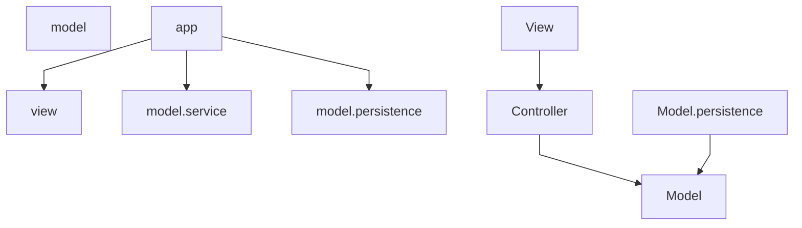

# Responsabilità e architettura

← [Home](https://github.com/ValerioGiglio04/rpg-MPGC/wiki/Home)

Ho organizzato il progetto in architettura MVC (Model-View-Controller): al centro il **dominio** (regole di gioco), intorno i **casi d'uso** (`model.service`), gli **model.persistence** verso H2 e la **UI** JavaFX. Il dominio non importa JavaFX, Hibernate o dettagli di I/O.

---

## Layer e dipendenze



| Layer | Package | Ruolo |
|-------|---------|-------|
| **app** | `...app` | Composition root: bootstrap JPA, seed catalogo, wiring servizi e `GameModel`, avvio JavaFX |
| **model** | `...model` | Modello, combattimento, validazione, eventi; porte in `model.persistence` |
| **model.service** | `...model.service` | Servizi di caso d'uso; `GameModel` come unico entry point per la UI |
| **model.persistence** | `...model.persistence` | Catalogo e sessioni su H2, mapping entità/DTO ↔ dominio |
| **view** / **controller** | `...view` | FXML, controller, navigazione, componenti — nessuna regola di business |

Le dipendenze vanno sempre verso il dominio: `ui` → `model.service` → `model`, e `model.persistence` → `model`. Vietato `model.service` → `ui` e `model.persistence` → `ui`.

Le coordinate overworld usano solo `OverworldPosition` (dominio). Layout di spawn e posizione di default stanno in `model.overworld`, non nella UI.

---

## Componenti principali

### Application e sessione

- **`GameModel`** — facciata per la UI: battaglia, cura, save/load, stato mappa, query `allGymsCompleted()` e `currentGym()`
- **`SessionPersistenceFacade`** — save/load/delete/list slot; incapsula `GameStateRepository`
- **`GameStateHolder`** — `GameState` corrente, id slot, posizione overworld opzionale
- **`BattleService`** — precondizioni battaglia, delega round a `BattleRoundExecutor`, completamento palestra
- **`NewGameService`** — costruisce il primo stato da `GameCatalog` e `NewGameSettings`
- **`HealingService`** — cura a pagamento; errori tipizzati con `HealingError` / `HealingException`
- **`GymCompletionHandler`** — gloria e creature acquisite al KO del boss
- **`DefaultGymStatusStrategy`** — calcolo `GymStatus` per ogni palestra sulla mappa

### Dominio

- **`GameState`** — giocatore, palestre, palestra corrente; regole `moveTo`, `canChallengeGym`, `allGymsCompleted`
- **`GameCatalog`** — template statici; lookup che crea istanze mutabili separate dal catalogo
- **`BattleRoundExecutor`** — un round: ordine turni, attacchi, switch su KO, lista `BattleEvent`
- **`AttackResolutionStrategy`** / **`BossMoveStrategy`** — algoritmi intercambiabili (impl in `model.combat.strategy.implementations`)
- **`Validator<T>`** + **`ValidatorFactory`** — costruzione validata via builder

### Adapter e bootstrap

- **`AppModule`** — unico punto di creazione dipendenze: EMF, seed, strategy, `PortraitAssetResolver`, `GameModel`
- **`HibernateGameCatalogLoader`** — carica catalogo da H2
- **`HibernateGameStateRepository`** — persistenza slot con JSON in `sessioni_salvate`
- **`SessioneJsonMapper`** / **`SessionJsonSerializer`** — dominio ↔ JSON (un solo parse al load)

### UI

- **`ScreenNavigator`** — policy di flusso e save/load con dialoghi
- **`ScreenFactory`**, **`RootScreenStack`** — costruzione FXML e swap schermata
- **Controller** (`BattleController`, `HubController`, `OverworldController`, …) — logica schermata verso `GameModel`
- **Controller FXML** — binding visivo sottile
- **`PortraitAssetResolver`** — path ritratti da catalogo (la UI non legge più `skinPath()` dalle istanze runtime)

---

## Organizzazione package

```
it.unicam.cs.mpgc.rpg125664
├── app/                    Main, RpgApplication, AppModule
├── model/
│   ├── model, catalog, event, builder, port
│   ├── combat/             BattleRoundExecutor, strategy/
│   └── validation/         Validator, implementations/, support/
├── model.service/
│   ├── BattleService, NewGameService, HealingService, …
│   ├── session/            GameModel, SessionPersistenceFacade, GameStateHolder
│   └── overworld/          GymStatus, strategy/, layout mappa
├── model.persistence/
│   ├── base/               AbstractHibernateAdapter
│   ├── catalog/            entities, dto, mapper, seed, implementations/
│   └── session/            entities, dto, mapper, serializer, implementations/
└── view/
    ├── navigation/         ScreenNavigator, support/ (ScreenFactory, …)
    ├── actions/            *Actions + implementations/
    ├── controller, controller, component, mapper, overworld, support, theme
```

Nei package estendibili uso **`implementations/`** (contratto implementato) e **`support/`** (helper, factory). Eccezioni: `model.entity`, `model.builder`, servizi in `model.service`, package UI per ruolo.

---

## Scelte di design

Ho usato SOLID non come etichette astratte, ma per decidere **dove mettere ogni responsabilità** e **cosa può cambiare senza riscrivere tutto**. Sotto: principio, dove sta nel progetto, e cosa succede in pratica.

### Responsabilità singola (SRP)

Ogni classe ha un motivo chiaro per cambiare.

| Classe / area | Package | Cosa fa (e cosa non fa) |
|---------------|---------|-------------------------|
| `BattleRoundExecutor` | `model.combat` | Un solo round: ordine turni, attacchi, switch su KO, emissione `BattleEvent`. Non decide precondizioni di battaglia né ricompense palestra |
| `BattleService` | `model.service` | Ciclo battaglia: `begin`, `attack`, `switchCreature`. Delega il round all'executor, non calcola danni inline |
| `SessionPersistenceFacade` | `model.service` | Save/load/delete/list slot. Non conosce JPQL né il formato JSON |
| `SessioneSalvataJpaRepository` | `model.persistence...session.implementations` | Solo query JPQL su `sessioni_salvate` |
| `SessionJsonSerializer` | `model.persistence...session.serializer` | Solo serializzazione/deserializzazione stringa JSON |
| `CatalogEntityMapper` | `model.persistence...catalog.mapper` | Solo mapping entità JPA → template dominio |
| `DefaultGymStatusStrategy` | `model.overworld.strategy.implementations` | Solo calcolo `GymStatus` per una palestra |
| Controller UI | `controller` | Stato schermata e comandi verso `GameModel`. Non caricano FXML |
| Controller FXML | `controller` | Binding visivo (`@FXML`). La logica sta nel controller |
| `PersistenceUiGuard` | `controller.navigation.support` | Solo gestione errori persistenza in UI (alert + messaggio i18n) |

Esempio concreto in battaglia: `BattleController` aggiorna label e bottoni; `BattleController` chiama `gameModel.attack(index)` e traduce gli eventi con `BattleEventTranslator`. Se cambio il layout FXML, tocco il controller; se cambio le regole di turno, tocco dominio/model.service.

### Aperto/chiuso (OCP)

Posso **estendere** comportamento aggiungendo classi, non modificando quelle esistenti.

| Estensione | Contratto | Implementazione attuale | Cosa aggiungerei |
|------------|-----------|-------------------------|------------------|
| Formula danno / critici | `AttackResolutionStrategy` | `TurnBasedAttackResolutionStrategy` | Nuova classe in `model.combat.strategy.implementations` |
| IA del boss | `BossMoveStrategy` | `AccuracyThresholdBossMoveStrategy` | Es. strategy che preferisce mosse ad alta potenza |
| Stato palestre sulla mappa | `GymStatusStrategy` | `DefaultGymStatusStrategy` | Nuova policy in `model.overworld.strategy.implementations` |
| Backend salvataggi | `GameStateRepository` | `HibernateGameStateRepository` | Es. repository REST o PostgreSQL |
| Validazione nuovo aggregato | `Validator<T>` | `*Validator` in `validation.implementations` | Nuova sottoclasse + riga in `ValidatorFactory` |

Il wiring delle nuove impl avviene in **`AppModule`**: creo la strategy, la passo a `BattleRoundExecutor` o al servizio, senza aprire `BattleService` per incollare `if/else`.

### Sostituzione di Liskov (LSP)

Le implementazioni rispettano il contratto dell'interfaccia/classe base e sono **intercambiabili** dove vengono iniettate.

- Qualsiasi `BossMoveStrategy` passata a `BattleRoundExecutor` deve restituire una mossa valida del boss con `pickMove()` — oggi `AccuracyThresholdBossMoveStrategy`, domani un'altra classe senza cambiare l'executor.
- `HibernateGameStateRepository` estende `AbstractHibernateAdapter` e implementa `GameStateRepository`: save/load/delete rispettano le stesse pre/post condizioni del contratto in `model.persistence`, indipendentemente da JPQL e Jackson.
- I `*Validator` estendono `Validator<T>`: ogni `validate(T)` lancia eccezione se l'aggregato è illegale; `GameStateValidator` compone `PlayerValidator` e `GymRoomValidator` sui figli.

Se una nuova impl non rispetta il contratto (es. `load()` che restituisce `null` silenzioso), rompe le aspettative di `GameModel` e della UI — per questo i contratti sono piccoli e espliciti.

### Interfacce segregate (ISP)

Evito interfacce "onnibusto": ogni client vede **solo i metodi che gli servono**.

**Porte dominio** (`model.persistence`):
- `GameCatalogLoader` — un solo metodo `load()`
- `BossMoveStrategy` — un solo metodo `pickMove()`

**Navigazione UI** (`controller.navigation`):
- `MainMenuNavigation` — `startNewGame`, `showLoadGame`
- `HubNavigation` — `showBattle`, `saveCurrent`, `saveAsNew`, `showMainMenu`
- `LoadGameNavigation`, `VictoryNavigation` — comandi della rispettiva schermata
- `ScreenNavigation` — unione di tutte, implementata da `ScreenNavigator`

`HubActionsImpl` dipende solo da **`HubNavigation`**, non da metodi del menu principale o della vittoria. Stesso pattern per `MainMenuActionsImpl`, `LoadGameActionsImpl`, `VictoryActionsImpl`.

**Callback verso FXML** (`controller.navigation`): `HubActions` espone solo `onStartBattle`, `onSave`, … — il controller hub non vede l'intera API di navigazione.

### Inversione dipendenze (DIP)

I moduli ad alto livello non dipendono da dettagli di basso livello; entrambi dipendono da **astrazioni**.

```
UI (controller)  →  GameModel  →  GameStateRepository (porta)
                                              ↑
                              HibernateGameStateRepository (model.persistence)
```

- **`BattleService`** non fa `new BattleRoundExecutor(...)` internamente: riceve l'executor già costruito (con le strategy) da **`AppModule`**.
- **`GameModel`** riceve `SessionPersistenceFacade`, che a sua volta usa l'interfaccia **`GameStateRepository`**, non `SessioneSalvataEntity` o JPQL.
- **UI** non importa `model.persistence`: legge stato tramite `GameModel` e controller; ritratti tramite **`PortraitAssetResolver`**, non `creature.skinPath()` sul dominio runtime.
- **Dominio** non importa nulla da `ui`, `model.persistence` o `model.service`.

Il punto di aggancio concreto è **`AppModule.bootstrap()` / costruttore**: lì istanzio EMF, catalogo, repository, strategy, servizi e `GameModel`.

### Pattern usati (oltre SOLID)

| Pattern | Dove | A cosa serve |
|---------|------|--------------|
| **Facade** | `GameModel`, `SessionPersistenceFacade` | API stabile per la UI, nasconde servizi e repository |
| **Builder + Validator** | `model.builder`, `model.validation` | Costruisco l'aggregato, poi `ValidatorFactory.get*Validator().validate(...)` |
| **Strategy** | `model.combat.strategy`, `model.overworld.strategy` | Algoritmi intercambiabili (danno, IA boss, stato mappa) |
| **Repository** | `GameStateRepository` + model.persistence | Persistenza slot senza SQL/JSON in model.service |
| **Controller (MVP)** | `controller` + controller | Separazione logica schermata / binding FXML |
| **Composition root** | `AppModule` | Un solo posto che conosce tutte le impl concrete |

---

## Flusso tipico (nuova partita → battaglia → save)

Passo per passo, con **chi** viene chiamato e **in quale layer**.

### 1. Avvio applicazione

1. `Main` → `RpgApplication.start()`
2. `AppModule.bootstrap()` — legge `catalog-seed.json`, `CatalogDatabaseSeeder` allinea H2, `HibernateGameCatalogLoader` costruisce `GameCatalog` in RAM
3. `AppModule` crea repository (`HibernateGameStateRepository` + `SessionJsonSerializer`), strategy combattimento, servizi e **`GameModel`**
4. `MainView` + **`ScreenNavigator`** mostrano il menu

### 2. Nuova partita

1. `MainMenuController` → `MainMenuActions` → `ScreenNavigator.startNewGame()`
2. **`NewGameService`** costruisce `GameState` iniziale da `GameCatalog` + `NewGameSettings` (team starter, palestra di partenza)
3. Stato salvato in **`GameStateHolder`**; navigazione verso Hub

### 3. Hub e overworld

1. `ScreenFactory.createHub()` monta `HubController` + **`HubController`** + **`OverworldMap`**
2. Movimento mappa: **`OverworldController`** + input tastiera su `OverworldMap`
3. Stato palestre: `GameModel.statusOf(gym)` → **`DefaultGymStatusStrategy`**
4. Click palestra: **`OverworldGymModalController`** chiede conferma; se serve, `GameModel.moveTo(gymId)`
5. Sfida: `HubActionsImpl.onStartBattle()` → `ScreenNavigator.showBattle()` (controlla `canChallengeGym`)

### 4. Battaglia

1. **`BattleService.begin()`** — reset HP per nuovo tentativo, selezione creature attive
2. Giocatore sceglie mossa → **`BattleController`** → `GameModel.attack(index)`
3. **`BattleService`** → **`BattleRoundExecutor`**: ordine per velocità, `TurnBasedAttackResolutionStrategy` per il danno, `AccuracyThresholdBossMoveStrategy` per il boss
4. Eventi **`BattleEvent`** → **`BattleEventTranslator`** → log in italiano
5. KO boss completo → **`GymCompletionHandler`** (gloria + creature nel team)
6. Fine sconto → `ScreenNavigator` torna all'Hub (o Vittoria se campagna finita)

### 5. Salvataggio

1. Menu hamburger Hub → `HubActionsImpl.onSave()` → `ScreenNavigator.saveCurrent()`
2. **`PersistenceUiGuard`** intercetta errori e mostra dialogo
3. **`SessionPersistenceFacade`** → **`GameStateRepository.save()`**
4. **`HibernateGameStateRepository`**: `SessioneJsonMapper.toDto()` → `SessionJsonSerializer` → riga in **`sessioni_salvate`**

Al **load**, il percorso è inverso: JSON → DTO → `GameState` + posizione mappa; nomi e mosse si rileggono dal catalogo H2 tramite gli `id` salvati (vedi [Persistenza](https://github.com/ValerioGiglio04/rpg-MPGC/wiki/Dati-e-persistenza)).

Vedi anche [Classi e interfacce](https://github.com/ValerioGiglio04/rpg-MPGC/wiki/Classi-e-interfacce) ed [Estendibilità](https://github.com/ValerioGiglio04/rpg-MPGC/wiki/Estendibilita).
