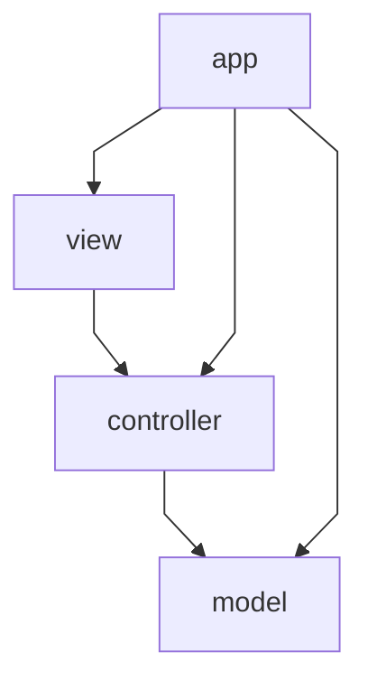
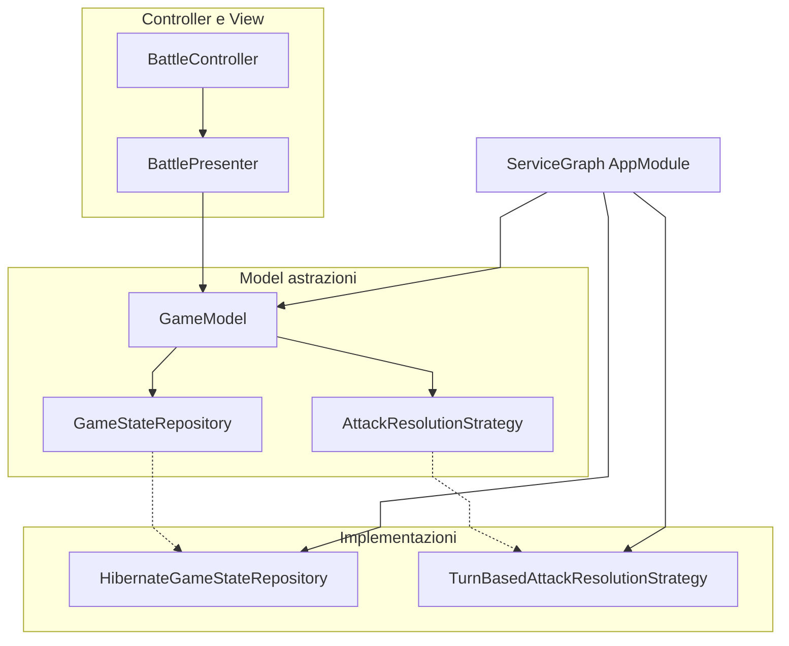

# Responsabilità e architettura

## Obiettivo architetturale

L'architettura è stata costruita per separare il più possibile:

- logica di dominio e regole di gioco;
- servizi applicativi e orchestrazione;
- persistenza;
- rendering e interazione JavaFX.

Questa separazione riduce l'accoppiamento e rende più semplice aggiungere palestre, creature, nuove schermate o backend di persistenza alternativi.

## Vista a livelli

| Livello | Package | Responsabilità principale |
| --- | --- | --- |
| Bootstrap | `...app` | Avvio JavaFX, EMF, seed catalogo, wiring `GameModel`. |
| Model | `...model` | Entità, combattimento, servizi, persistenza — nessuna dipendenza da JavaFX. |
| View | `...view` | FXML, componenti UI, mappa overworld, messaggi e tema. |
| Controller | `...controller` | Input utente, navigazione scene, presenter. |

Le dipendenze vanno **controller → model** e **view → controller**. Il model non importa classi JavaFX.

## Responsabilità individuate

### 1. Bootstrap

Responsabilità:

- avviare JavaFX (`RpgApplication`);
- creare EntityManagerFactory e repository;
- eseguire seed e caricamento catalogo (`CatalogBootstrap`);
- assemblare servizi e `GameModel` (`ServiceGraph`, `AppModule`).

### 2. Navigazione scene

Responsabilità:

- caricare le scene FXML da path centralizzati (`FxmlPaths`, `ScreenFactory`);
- istanziare i controller con le dipendenze corrette;
- centralizzare i cambi scena e i dialoghi save/load (`ScreenNavigator`);
- esporre interfacce piccole per schermata (`*Actions`, `*Navigation`).

### 3. Controller e presenter frontend

Responsabilità:

- leggere input utente dai controller FXML;
- invocare `GameModel` e le interfacce di navigazione;
- aggiornare la view in base allo stato corrente;
- non contenere regole di persistenza o logica di dominio riutilizzabile.

La logica di schermata più articolata è estratta nei presenter (`BattlePresenter`, `HubPresenter`, `OverworldPresenter`) per evitare controller FXML troppo grandi.

### 4. Orchestrazione applicativa

Responsabilità:

- gestire il ciclo di gioco (nuova partita, battaglia, cura, save/load);
- mantenere compatta l'API usata dalla UI (`GameModel`);
- delegare ai servizi specializzati (`BattleService`, `NewGameService`, `HealingService`, `SessionPersistenceFacade`).

### 5. Dominio

Responsabilità:

- rappresentare entità e aggregati (`GameState`, `Player`, `Creature`, `GymRoom`, …);
- contenere regole stabili (`moveTo`, `canChallengeGym`, completamento campagna);
- restare indipendente da JavaFX e dal formato fisico dei file.

### 6. Persistenza

Responsabilità:

- trasformare lo stato runtime in snapshot serializzabili (JSON in `sessioni_salvate`);
- caricare e validare dati salvati;
- isolare Hibernate/JPA e H2 dalle regole di gioco (`GameStateRepository`, adapter in `model.persistence`).

Il catalogo statico vive in tabelle H2 separate dallo snapshot di partita.

### 7. Estensioni via strategy

Responsabilità:

- incapsulare algoritmi intercambiabili (danno, IA boss, stato palestre sulla mappa);
- permettere sostituzione delle implementazioni in `ServiceGraph` senza modificare `BattleService` o `BattleRoundExecutor`.

## Scelte progettuali rilevanti

### Pattern utilizzati

#### Facade

`GameModel` svolge il ruolo di facciata verso il frontend.
Espone operazioni come nuova partita, battaglia, cura, save/load e consultazione stato mappa, senza esporre tutti i servizi interni.

#### Strategy

Interfacce come `AttackResolutionStrategy`, `BossMoveStrategy` e `GymStatusStrategy` permettono di variare algoritmi senza riscrivere i client.

#### Repository

`GameStateRepository` isola la persistenza multi-slot. L'implementazione attuale usa Hibernate e JSON in colonna CLOB.

#### Factory

`ScreenFactory` e `HubTeamRowFactory` centralizzano la creazione di schermate e righe UI.

#### Builder / parameter object

Per evitare metodi con troppi parametri, il progetto usa builder fluenti (`GameModelOptions`, `HealingCheck`, `ArenaLayoutSpec`, …).
Nessun metodo pubblico supera **3 argomenti**.

#### Separazione MVC

Il model non importa JavaFX; i controller non importano entità JPA.
FXML e CSS restano nella view; le regole di gioco restano nel model.

### Benefici della struttura attuale

La ripartizione delle responsabilità consente di:

- estendere catalogo e palestre senza rifare il sistema di save/load;
- sostituire strategy di combattimento o mappa registrando nuove implementazioni;
- sostituire il backend sessione implementando `GameStateRepository`;
- evolvere il frontend JavaFX mantenendo invariata l'API di `GameModel`;
- testare in modo separato servizi, validator e persistenza.

## Scelte di design (SOLID nel contesto MVC)

I principi SOLID guidano la separazione tra model, view e controller. Nel codice compaiono come interfacce piccole, classi con un solo motivo di cambiamento e wiring centralizzato in `ServiceGraph`.

### S — Single Responsibility Principle

*Ogni classe ha un solo motivo per cambiare.*

| Classe / componente | Responsabilità unica | Layer MVC |
| --- | --- | --- |
| `BattleRoundExecutor` | Esegue **un round** di combattimento (ordine attacchi, KO, swap) | Model |
| `BattleService` | Avvia e chiude una **battaglia** delegando al round executor | Model |
| `BattleController` | Collega input UI (bottoni mosse) alla view del duello | Controller |
| `BattlePresenter` | Stato schermata battaglia: log, turni, messaggi di esito | Controller |
| `BattleEventTranslator` | Traduce `BattleEvent` del model in righe leggibili per la UI | View |
| `SessionPersistenceFacade` | API save/load verso il repository, senza dettagli Hibernate | Model |
| `ScreenFactory` | Carica FXML + controller da `FxmlPaths` | Controller |
| `CatalogBootstrap` | Seed e caricamento catalogo all'avvio | app |

Quando cambia il calcolo del danno si modifica `TurnBasedAttackResolutionStrategy`, non `BattleController`.
Quando cambia la resa del log si modifica `BattleLogRenderer`, non `GameState`.

### O — Open/Closed Principle

*Aperto all'estensione, chiuso alla modifica.*

Nuovi comportamenti si aggiungono **implementando** interfacce esistenti o registrando strategy in `ServiceGraph`, senza riscrivere il codice client.

| Estensione | Interfaccia | Implementazione attuale | Dove si collega |
| --- | --- | --- | --- |
| Regole danno / precisione | `AttackResolutionStrategy` | `TurnBasedAttackResolutionStrategy` | `BattleRoundExecutor` |
| IA scelta mossa del boss | `BossMoveStrategy` | `AccuracyThresholdBossMoveStrategy` | `BattleRoundExecutor` |
| Stato visivo palestra sulla mappa | `GymStatusStrategy` | `DefaultGymStatusStrategy` | `GameModel` |
| Validazione entità | `Validator<T>` | `CreatureValidator`, `MoveValidator`, … | `ValidatorFactory` |
| Skin CSS alternativa | `UiTheme` | `DuelUiTheme` | root FXML battaglia |

Per un boss con IA diversa basta creare `RandomBossMoveStrategy implements BossMoveStrategy` e sostituire l'istanza in `ServiceGraph.assemble()`. `BattleRoundExecutor` e `BattleService` restano invariati.

### L — Liskov Substitution Principle

*Ogni implementazione rispetta il contratto dell'interfaccia e può sostituirla senza rompere i client.*

| Interfaccia | Implementazioni sostituibili | Client che le usa |
| --- | --- | --- |
| `AttackResolutionStrategy` | `TurnBasedAttackResolutionStrategy` (e future varianti) | `BattleRoundExecutor` |
| `BossMoveStrategy` | `AccuracyThresholdBossMoveStrategy` | `BattleRoundExecutor` |
| `GymStatusStrategy` | `DefaultGymStatusStrategy` | `GameModel` |
| `GameStateRepository` | `HibernateGameStateRepository` | `SessionPersistenceFacade` |
| `GameCatalogLoader` | `HibernateGameCatalogLoader` | `CatalogBootstrap` |
| `HubActions` | `HubActionsImpl` (via `ScreenNavigator`) | `HubController` |
| `UiTheme` | `DuelUiTheme` | schermata battaglia |

`GameModel` dipende da `GymStatusStrategy`, non da `DefaultGymStatusStrategy`. In test o in varianti del gioco è possibile passare un'altra implementazione con lo stesso contratto.

### I — Interface Segregation Principle

*Interfacce piccole e ruolo-specifiche, così ogni client dipende solo da ciò che usa.*

| Interfaccia | Cosa espone | Chi la usa |
| --- | --- | --- |
| `MainMenuActions` | Nuova partita, carica, esci | `MainMenuController` |
| `LoadGameActions` | Selezione slot, elimina save | `LoadGameController` |
| `HubActions` | Duello, salva, menu | `HubController` |
| `HubNavigation` | Navigazione verso battaglia / menu | `HubController` |
| `VictoryActions` | Ritorno al menu dopo vittoria | `VictoryController` |
| `ScreenNavigation` | Unione delle navigation (implementata da `ScreenNavigator`) | bootstrap / wiring |
| `BossMoveStrategy` | Solo scelta mossa IA | `BattleRoundExecutor` |
| `AttackResolutionStrategy` | Solo risoluzione danno | `BattleRoundExecutor` |

`HubController` riceve `HubActions`, non l'intera API di navigazione del menu o del load game. `LoadGameActionsImpl` non dipende da metodi dell'hub come `onStartBattle()`.

### D — Dependency Inversion Principle

*I moduli alto livello non dipendono dai dettagli di basso livello: entrambi dipendono da astrazioni.*

| Alto livello | Astrazione | Dettaglio concreto | Dove avviene l'injection |
| --- | --- | --- | --- |
| Controller e presenter | `GameModel` | `BattleService`, `HealingService`, … | `ServiceGraph` → `GameModelOptions` |
| `SessionPersistenceFacade` | `GameStateRepository` | `HibernateGameStateRepository` | `AppModule` |
| `BattleRoundExecutor` | `AttackResolutionStrategy`, `BossMoveStrategy` | impl in `strategy.implementations` | `ServiceGraph` |
| Controller FXML | `HubActions`, `ScreenNavigation`, … | `ScreenNavigator`, `*ActionsImpl` | `MainView` / `ScreenFactory` |

Regola MVC: il **model non importa JavaFX**; i controller non importano Hibernate. `HubController` chiama `gameModel.healActiveCreature()` e `hubActions.onSave()` — non apre sessioni JPA né costruisce dialoghi save.

## Firme metodo e parameter object

Per evitare code smell da troppi parametri, **nessun metodo pubblico supera 3 argomenti**. Se servono più valori:

1. **Builder fluente** (scelta preferita): es. `HealingCheck.builder()…build()`, `BattleCommandBindings.builder()`, `GymPlacementRequest.builder()`.
2. **Record** solo per DTO, comandi ed eventi immutabili (`SaveSessionCommand`, `BattleEvent`, …), non per wiring o helper UI.

**Naming** dei parameter object: `*Options` per assemblaggio (`GameModelOptions`, `SessionRepositoryOptions`); `*Context` per contesto condiviso; `*Bindings` per callback UI; `*Spec` per layout.

Convenzione package: interfacce nel package padre (`*Navigation`, `Validator`, `UiTheme`), implementazioni in sottocartella `implementations/`.

Elenco tipi con responsabilità: [Classi e interfacce](Classi-e-interfacce). Estensioni future: [Estendibilità](Estendibilita).
