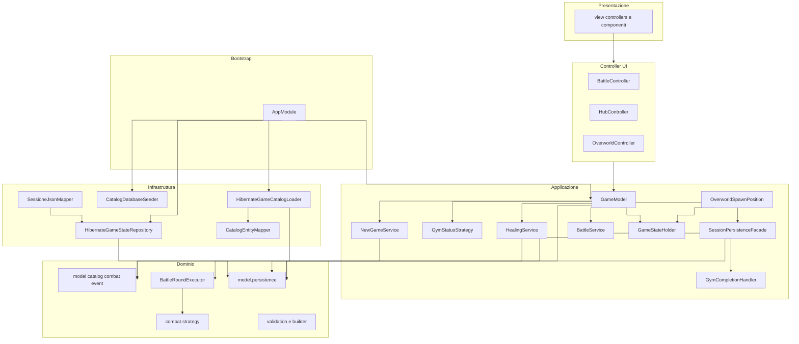

# Responsabilità e architettura

> [← Indice Wiki](https://github.com/ValerioGiglio04/rpg-MPGC/wiki/Home) · [Funzionalità](https://github.com/ValerioGiglio04/rpg-MPGC/wiki/Funzionalita-implementate) · [Classi](https://github.com/ValerioGiglio04/rpg-MPGC/wiki/Classi-e-interfacce) · [Persistenza](https://github.com/ValerioGiglio04/rpg-MPGC/wiki/Dati-e-persistenza) · [Estendibilità](https://github.com/ValerioGiglio04/rpg-MPGC/wiki/Estendibilita)

Il progetto segue un'**architettura MVC** (Model-View-Controller): il **dominio** è al centro e non dipende da JavaFX, Hibernate o dettagli di I/O. L'**applicazione** orchestra i casi d'uso. Gli **model.persistence** implementano le porte verso H2. La **UI** presenta i dati e inoltra le azioni dell'utente.

---

## Responsabilità per layer

| Layer | Package | Responsabilità principale |
|-------|---------|---------------------------|
| **app** | `it.unicam.cs.mpgc.rpg125664.app` | Composition root: bootstrap JPA, seed catalogo, wiring di servizi e `GameModel`, avvio JavaFX, rilascio risorse |
| **model** | `...model` (+ `model.persistence`, `model.combat.strategy`) | Modello di gioco, regole, combattimento, validazione, eventi di battaglia; **porte** in `model.persistence` |
| **model.service** | `...model.service` (+ `model.service`) | Servizi di caso d'uso e `GameModel` come unico entry point per la UI |
| **model.persistence** | `...model.persistence` | Catalogo su H2 (JPA), sessione su JSON, mapping entità/DTO ↔ dominio, seed catalogo da JSON |
| **view** / **controller** | `...view` (+ `controller`, `controller`, `component`, `overworld`, `theme`) | Schermate FXML, controller sottili, controller (stato + comandi), componenti visivi, mappa overworld, temi, messaggi — **nessuna regola di business** |

### Regola di dipendenza

Le frecce vanno sempre **verso il dominio**:

- `ui` → `model.service` → `model`
- `model.persistence` → `model` (implementa le porte)
- `app` → tutti i layer (solo per composizione all'avvio)

Il dominio **non importa** classi da `ui`, `model.persistence` o `model.service`.

**Vietato:** `model.service` → `ui` e `model.persistence` → `ui`. Le coordinate overworld usano solo `OverworldPosition` (dominio); layout di spawn e posizione di default stanno in `model.overworld`, non nel package UI.

---

## Diagramma delle dipendenze

> Diagramma in sintassi Mermaid: bozza creata con **ChatGPT / Claude**, integrata e verificata da me. Dettaglio in [Dichiarazione AI](https://github.com/ValerioGiglio04/rpg-MPGC/wiki/Dichiarazione-AI#grafici-mermaid-nella-wiki-chatgpt-e-claude).

---

## Responsabilità di alto livello (use case)

| Componente | Cosa fa |
|------------|---------|
| `GameModel` | Facciata per la UI: delega a servizi, `SessionPersistenceFacade` e `GymStatusStrategy` |
| `SessionPersistenceFacade` | Save/load/delete/list slot; incapsula `GameStateRepository` |
| `DefaultGymStatusStrategy` | Implementazione default di `GymStatusStrategy` (`model.overworld.strategy.impl`) |
| `GameStateHolder` | `GameState` corrente, `currentSessionId`, `OverworldPosition` |
| `BattleService` | Precondizioni battaglia, delega round a `BattleRoundExecutor`, completamento palestra |
| `BattleRoundExecutor` | Un round: ordine turni, doppio attacco, switch su KO, assembly `BattleEvent` |
| `NewGameService` | Costruisce e sostituisce lo stato iniziale da catalogo |
| `HealingService` | Cura a pagamento; errori tipizzati via `HealingError` / `HealingException` |
| `GymCompletionHandler` | Ricompense al KO boss; usa `GameCatalog.buildCreature()` |
| `OverworldSpawnPosition` | Posizione di default al primo salvataggio (senza dipendere dalla UI) |
| `GameState` | Invarianti di mondo: palestra corrente, raggiungibilità, possibilità di sfida |
| `GameCatalog` | Lookup dati statici; istanze di dominio **mutabili** separate dal catalogo |
| `TurnBasedAttackResolutionStrategy` | Risoluzione matematica di un singolo attacco (`model.combat.strategy.impl`) |
| `BossMoveStrategy` | Scelta mossa del boss (`model.combat.strategy`; impl: soglia accuratezza) |
| `*Controller` (UI) | Stato schermata + comandi verso `GameModel`; controller FXML sottili |

---

## Principi SOLID nel progetto

### Single Responsibility (SRP)

- `AttackResolutionStrategy` calcola solo l'esito di un attacco.
- `BattleRoundExecutor` esegue solo un round di battaglia.
- `BossMoveStrategy` decide solo quale mossa usare il boss.
- `GymCompletionHandler` gestisce solo le conseguenze del completamento palestra.
- `SessionPersistenceFacade` gestisce solo persistenza slot; `DefaultGymStatusStrategy` solo stato palestre sulla mappa.
- `CatalogEntityMapper` mappa solo entità JPA → template di dominio.
- I controller UI separano binding FXML da logica di schermata.
- I validator (`CreatureValidator`, `GameStateValidator`, …) validano un solo aggregato ciascuno.

### Open/Closed (OCP)

- Nuova IA boss: nuova classe che implementa `BossMoveStrategy` senza modificare `BattleService`.
- Nuova strategy di risoluzione attacco: nuova implementazione di `AttackResolutionStrategy`.
- Nuova policy overworld: nuova implementazione di `GymStatusStrategy`.
- Nuovo backend di salvataggio: nuova implementazione di `GameStateRepository`.
- Nuovo validator di dominio: sottoclasse di `AbstractDomainValidator` registrata in `Validators`, senza cambiare il contratto `Validator<T>`.
- Nuovo model.persistence Hibernate: sottoclasse di `AbstractHibernateAdapter` che implementa una porta di dominio.

### Liskov Substitution (LSP)

- Qualsiasi `AttackResolutionStrategy` o `BossMoveStrategy` iniettata in `BattleService` è intercambiabile se rispetta il contratto delle interfacce.
- I validator concreti sostituiscono `AbstractDomainValidator` rispettando `validate(T)`; i loader/repository Hibernate sostituiscono la base astratta mantenendo le porte.

### Interface Segregation (ISP)

- Porte piccole: `GameCatalogLoader` ha un solo metodo `load()`; `BossMoveStrategy` un solo metodo `pickMove()`.

### Dependency Inversion (DIP)

- `BattleService` dipende da `AttackResolutionStrategy` e `BossMoveStrategy` (`model.combat.strategy`), non da classi concrete hard-coded oltre al wiring in `AppModule`.
- La UI dipende da `GameModel`, non da `HibernateGameStateRepository` né dalle entità JPA.

---

## Dove trovare contratto vs implementazione

| Cerchi… | Contratto (tipo) | Implementazione |
|---------|------------------|-----------------|
| Porta persistenza | `model.persistence` | `model.persistence.session` / `.catalog` |
| Strategy combattimento | `model.combat.strategy` | `model.combat.strategy.impl` |
| Strategy mappa | `model.overworld.strategy` | `model.overworld.strategy.impl` |
| Facade UI | `model.service` (`GameModel`, `SessionPersistenceFacade`) | — (concrete, no `facade/`) |
| Tema UI | `view.theme` (`UiTheme`) | `view.theme.impl` |
| Controller MVP | `controller` | controller in `controller` |

---

## Pattern utilizzati

| Pattern | Package | Scopo |
|---------|---------|-------|
| **Facade** | `model.service` (`GameModel`, `SessionPersistenceFacade`) | API stabile per la UI |
| **Controller** | `controller` | Controller sottili; stato e comandi verso `GameModel` |
| **Builder** | `model.builder` | Costruzione validata di aggregati |
| **Strategy** | `model.combat.strategy`, `model.overworld.strategy` | Algoritmi intercambiabili; impl in `*.strategy.impl` |
| **Template Method** | `model.validation`, `model.persistence` | Passi comuni in `validate(T)` e gestione `EntityManager`; dettaglio nelle sottoclassi |
| **Repository** | `model.persistence` (`GameStateRepository`) | Astrazione persistenza stato dinamico |
| **Composition root** | `app` (`AppModule`) | Unico punto di creazione dipendenze |
| **Sealed interface** | `model.event` (`BattleEvent`) | Eventi di battaglia esaustivi per il translator UI |

Gerarchia tipica dove serve estensione: **interfaccia** (in `model.persistence` o `*.strategy`) → **classe astratta** (model.persistence o validator) → **implementazione concreta** (in `model.persistence` o `*.strategy.impl`). Le porte restano in `model.persistence`; le classi astratte stanno in `validation` o in `model.persistence`.

---

## Estendibilità multi-dispositivo

La specifica richiede che sia chiaro come il progetto possa girare su **desktop, mobile, web** in futuro:

- **Oggi:** solo UI JavaFX (`view`).
- **Domani:** sostituire il package `ui` con un model.persistence REST, CLI o mobile che chiami gli stessi servizi dietro `GameModel` (o una sua evoluzione tipo API model.service service).
- Il **dominio** e l'**applicazione** restano invariati; cambiano solo presentation e, se necessario, model.persistence di persistenza.

Dettagli operativi in [Estendibilità](https://github.com/ValerioGiglio04/rpg-MPGC/wiki/Estendibilita).
