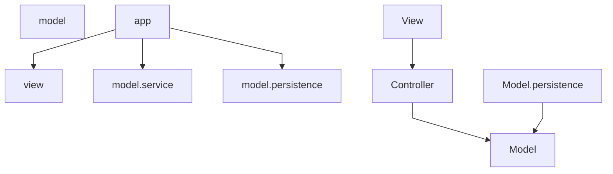

# Responsabilità e architettura

← [Home](https://github.com/ValerioGiglio04/rpg-MPGC/wiki/Home)

Ho organizzato il progetto in architettura MVC (Model-View-Controller): al centro il **dominio** (regole di gioco), intorno i **casi d'uso** (`model.service`), gli **model.persistence** verso H2 e la **UI** JavaFX. Il dominio non importa JavaFX, Hibernate o dettagli di I/O.

---

## Layer e dipendenze



| Layer | Package | Ruolo |
|-------|---------|-------|
| **app** | `...app` | Composition root: bootstrap JPA, seed catalogo, wiring servizi e `GameModel`, avvio JavaFX |
| **model** | `...model` | Modello, combattimento, validazione, eventi; porte in `model.persistence` |
| **model.service** | `...model.service` | Servizi di caso d'uso; `GameModel` come unico entry point per la UI |
| **model.persistence** | `...model.persistence` | Catalogo e sessioni su H2, mapping entità/DTO ↔ dominio |
| **view** / **controller** | `...view` | FXML, controller, navigazione, componenti — nessuna regola di business |

Le dipendenze vanno sempre verso il dominio: `ui` → `model.service` → `model`, e `model.persistence` → `model`. Vietato `model.service` → `ui` e `model.persistence` → `ui`.

Le coordinate overworld usano solo `OverworldPosition` (dominio). Layout di spawn e posizione di default stanno in `model.overworld`, non nella UI.

---

## Componenti principali

### Application e sessione

- **`GameModel`** — facciata per la UI: battaglia, cura, save/load, stato mappa, query `allGymsCompleted()` e `currentGym()`
- **`SessionPersistenceFacade`** — save/load/delete/list slot; incapsula `GameStateRepository`
- **`GameStateHolder`** — `GameState` corrente, id slot, posizione overworld opzionale
- **`BattleService`** — precondizioni battaglia, delega round a `BattleRoundExecutor`, completamento palestra
- **`NewGameService`** — costruisce il primo stato da `GameCatalog` e `NewGameSettings`
- **`HealingService`** — cura a pagamento; errori tipizzati con `HealingError` / `HealingException`
- **`GymCompletionHandler`** — gloria e creature acquisite al KO del boss
- **`DefaultGymStatusStrategy`** — calcolo `GymStatus` per ogni palestra sulla mappa

### Dominio

- **`GameState`** — giocatore, palestre, palestra corrente; regole `moveTo`, `canChallengeGym`, `allGymsCompleted`
- **`GameCatalog`** — template statici; lookup che crea istanze mutabili separate dal catalogo
- **`BattleRoundExecutor`** — un round: ordine turni, attacchi, switch su KO, lista `BattleEvent`
- **`AttackResolutionStrategy`** / **`BossMoveStrategy`** — algoritmi intercambiabili (impl in `model.combat.strategy.implementations`)
- **`Validator<T>`** + **`ValidatorFactory`** — costruzione validata via builder

### Adapter e bootstrap

- **`AppModule`** — unico punto di creazione dipendenze: EMF, seed, strategy, `PortraitAssetResolver`, `GameModel`
- **`HibernateGameCatalogLoader`** — carica catalogo da H2
- **`HibernateGameStateRepository`** — persistenza slot con JSON in `sessioni_salvate`
- **`SessioneJsonMapper`** / **`SessionJsonSerializer`** — dominio ↔ JSON (un solo parse al load)

### UI

- **`ScreenNavigator`** — policy di flusso e save/load con dialoghi
- **`ScreenFactory`**, **`RootScreenStack`** — costruzione FXML e swap schermata
- **Controller** (`BattleController`, `HubController`, `OverworldController`, …) — logica schermata verso `GameModel`
- **Controller FXML** — binding visivo sottile
- **`PortraitAssetResolver`** — path ritratti da catalogo (la UI non legge più `skinPath()` dalle istanze runtime)

---

## Organizzazione package

```
it.unicam.cs.mpgc.rpg125664
├── app/                    Main, RpgApplication, AppModule
├── model/
│   ├── model, catalog, event, builder, port
│   ├── combat/             BattleRoundExecutor, strategy/
│   └── validation/         Validator, implementations/, support/
├── model.service/
│   ├── BattleService, NewGameService, HealingService, …
│   ├── session/            GameModel, SessionPersistenceFacade, GameStateHolder
│   └── overworld/          GymStatus, strategy/, layout mappa
├── model.persistence/
│   ├── base/               AbstractHibernateAdapter
│   ├── catalog/            entities, dto, mapper, seed, implementations/
│   └── session/            entities, dto, mapper, serializer, implementations/
└── view/
    ├── navigation/         ScreenNavigator, support/ (ScreenFactory, …)
    ├── actions/            *Actions + implementations/
    ├── controller, controller, component, mapper, overworld, support, theme
```

Nei package estendibili uso **`implementations/`** (contratto implementato) e **`support/`** (helper, factory). Eccezioni: `model.entity`, `model.builder`, servizi in `model.service`, package UI per ruolo.

---

## Scelte di design

Ho applicato SOLID con esempi concreti nel codice:

- **Responsabilità singola** — `BattleRoundExecutor` esegue solo un round; `SessionPersistenceFacade` solo persistenza; i controller separano binding FXML e comandi verso `GameModel`
- **Aperto/chiuso** — nuova IA boss = nuova `BossMoveStrategy`; nuovo backend save = nuova impl di `GameStateRepository`
- **Sostituzione di Liskov** — strategy e validator intercambiabili se rispettano il contratto
- **Interfacce segregate** — porte piccole (`GameCatalogLoader.load()`); navigazione UI spezzata in `MainMenuNavigation`, `HubNavigation`, … unite da `ScreenNavigation`
- **Inversione dipendenze** — `BattleService` riceve `BattleRoundExecutor` da `AppModule`; la UI dipende da `GameModel`, non da Hibernate

Pattern usati: **Facade** (`GameModel`), **Builder** + **Validator**, **Strategy** (combattimento e mappa), **Repository** (`GameStateRepository`), **Controller** (MVP in UI), **Composition root** (`AppModule`).

---

## Flusso tipico (nuova partita → battaglia)

1. `AppModule.bootstrap()` — seed catalogo H2, load `GameCatalog`, crea `GameModel`
2. Menu → `NewGameService` costruisce `GameState` iniziale
3. Hub → `OverworldController` + `OverworldMap`; sfida palestra → `ScreenNavigator.showBattle()`
4. Battaglia → `BattleService` + `BattleRoundExecutor`; eventi tradotti da `BattleEventTranslator`
5. Save → `SessionPersistenceFacade` → `HibernateGameStateRepository` → JSON in H2

Vedi anche [Classi e interfacce](https://github.com/ValerioGiglio04/rpg-MPGC/wiki/Classi-e-interfacce), [Persistenza](https://github.com/ValerioGiglio04/rpg-MPGC/wiki/Dati-e-persistenza), [Estendibilità](https://github.com/ValerioGiglio04/rpg-MPGC/wiki/Estendibilita).
