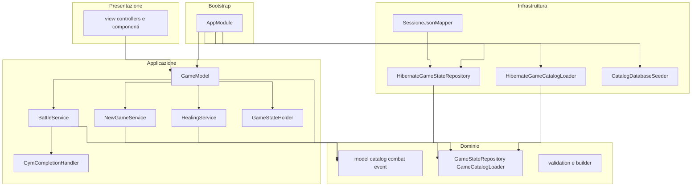

# Responsabilità e architettura

> [← Indice Wiki](https://github.com/ValerioGiglio04/rpg-MPGC/wiki/Home) · [Funzionalità](https://github.com/ValerioGiglio04/rpg-MPGC/wiki/Funzionalita-implementate) · [Classi](https://github.com/ValerioGiglio04/rpg-MPGC/wiki/Classi-e-interfacce) · [Persistenza](https://github.com/ValerioGiglio04/rpg-MPGC/wiki/Dati-e-persistenza)

Il progetto segue un'**architettura MVC** (Model-View-Controller): il **dominio** è al centro e non dipende da JavaFX, Hibernate o dettagli di I/O. L'**applicazione** orchestra i casi d'uso. Gli **model.persistence** implementano le porte verso H2. La **UI** presenta i dati e inoltra le azioni dell'utente.

---

## Responsabilità per layer

| Layer | Package | Responsabilità principale |
|-------|---------|---------------------------|
| **app** | `it.unicam.cs.mpgc.rpg125664.app` | Composition root: bootstrap JPA, seed catalogo, wiring di servizi e `GameModel`, avvio JavaFX, rilascio risorse |
| **model** | `...model` | Modello di gioco, regole, combattimento, validazione, eventi di battaglia, **porte** verso persistenza e catalogo |
| **model.service** | `...model.service` (+ `model.service`) | Servizi di caso d'uso e `GameModel` come unico entry point per la UI |
| **model.persistence** | `...model.persistence` | Catalogo su H2 (JPA), sessione su JSON, mapping entità/DTO ↔ dominio, seed catalogo da JSON |
| **view** / **controller** | `...view` (+ `controller`, `component`, `overworld`, `theme`) | Schermate FXML, controller, componenti visivi, mappa overworld, temi, messaggi — **nessuna regola di business** |

### Regola di dipendenza

Le frecce vanno sempre **verso il dominio**:

- `ui` → `model.service` → `model`
- `model.persistence` → `model` (implementa le porte)
- `app` → tutti i layer (solo per composizione all'avvio)

Il dominio **non importa** classi da `ui`, `model.persistence` o `model.service`.

---

## Diagramma delle dipendenze

> Diagramma in sintassi Mermaid: bozza creata con **ChatGPT / Claude**, integrata e verificata da me. Dettaglio in [Dichiarazione AI](https://github.com/ValerioGiglio04/rpg-MPGC/wiki/Dichiarazione-AI#grafici-mermaid-nella-wiki-chatgpt-e-claude).

---

## Responsabilità di alto livello (use case)

| Componente | Cosa fa |
|------------|---------|
| `GameModel` | Espone all'UI tutte le operazioni: nuova partita, navigazione palestre, stato palestra, battaglia, cura, save/load |
| `GameStateHolder` | Mantiene il riferimento mutabile allo `GameState` corrente in memoria |
| `BattleService` | Ciclo di vita battaglia: preparazione, round con `CombatEngine`, IA boss, switch, delega completamento palestra |
| `NewGameService` | Costruisce e sostituisce lo stato iniziale da catalogo |
| `HealingService` | Calcolo costo cura e gloria spendibile con riserva per palestre sfidabili |
| `GymCompletionHandler` | Ricompense al KO di tutte le creature boss |
| `GameState` | Invarianti di mondo: palestra corrente, raggiungibilità, possibilità di sfida |
| `GameCatalog` | Lookup dati statici; istanze di dominio **mutabili** separate dal catalogo |
| `TurnBasedCombatEngine` | Risoluzione matematica di un singolo attacco |
| `BossMoveStrategy` | Scelta mossa del boss (implementazione: soglia accuratezza) |

---

## Principi SOLID nel progetto

### Single Responsibility (SRP)

- `CombatEngine` calcola solo l'esito di un attacco.
- `BossMoveStrategy` decide solo quale mossa usare il boss.
- `GymCompletionHandler` gestisce solo le conseguenze del completamento palestra.
- I validator (`CreatureValidator`, `GameStateValidator`, …) validano un solo aggregato ciascuno.

### Open/Closed (OCP)

- Nuova IA boss: nuova classe che implementa `BossMoveStrategy` senza modificare `BattleService`.
- Nuovo motore di combattimento: nuova implementazione di `CombatEngine`.
- Nuovo backend di salvataggio: nuova implementazione di `GameStateRepository`.
- Nuovo validator di dominio: sottoclasse di `AbstractDomainValidator` registrata in `Validators`, senza cambiare il contratto `Validator<T>`.
- Nuovo model.persistence Hibernate: sottoclasse di `AbstractHibernateAdapter` che implementa una porta di dominio.

### Liskov Substitution (LSP)

- Qualsiasi `CombatEngine` o `BossMoveStrategy` iniettata in `BattleService` è intercambiabile se rispetta il contratto delle interfacce.
- I validator concreti sostituiscono `AbstractDomainValidator` rispettando `validate(T)`; i loader/repository Hibernate sostituiscono la base astratta mantenendo le porte.

### Interface Segregation (ISP)

- Porte piccole: `GameCatalogLoader` ha un solo metodo `load()`; `BossMoveStrategy` un solo metodo `pickMove()`.

### Dependency Inversion (DIP)

- `BattleService` dipende da `CombatEngine` e `BossMoveStrategy` (astrazioni), non da classi concrete hard-coded oltre al wiring in `AppModule`.
- La UI dipende da `GameModel`, non da `HibernateGameStateRepository` né dalle entità JPA.

---

## Pattern utilizzati

| Pattern | Dove | Scopo |
|---------|------|-------|
| **Facade** | `GameModel` | API stabile per la UI |
| **Builder** | `*Builder` nel dominio | Costruzione validata di aggregati |
| **Strategy** | `BossMoveStrategy`, `CombatEngine` | Algoritmi intercambiabili |
| **Template Method** | `AbstractDomainValidator`, `AbstractHibernateAdapter` | Passi comuni in `validate(T)` e gestione `EntityManager`; dettaglio nelle sottoclassi |
| **Repository** | `GameStateRepository` | Astrazione persistenza stato dinamico |
| **Composition root** | `AppModule` | Unico punto di creazione dipendenze |
| **Sealed interface** | `BattleEvent` | Eventi di battaglia esaustivi per il translator UI |

Gerarchia tipica dove serve estensione: **interfaccia di dominio** → **classe astratta** (model.persistence o validator) → **implementazione concreta**. Le porte restano nel dominio; le classi astratte stanno in `validation` o in `model.persistence`.

---

## Estendibilità multi-dispositivo

La specifica richiede che sia chiaro come il progetto possa girare su **desktop, mobile, web** in futuro:

- **Oggi:** solo UI JavaFX (`view`).
- **Domani:** sostituire il package `ui` con un model.persistence REST, CLI o mobile che chiami gli stessi servizi dietro `GameModel` (o una sua evoluzione tipo API model.service service).
- Il **dominio** e l'**applicazione** restano invariati; cambiano solo presentation e, se necessario, model.persistence di persistenza.

Dettagli operativi in [Estendibilità](https://github.com/ValerioGiglio04/rpg-MPGC/wiki/Estendibilita).
