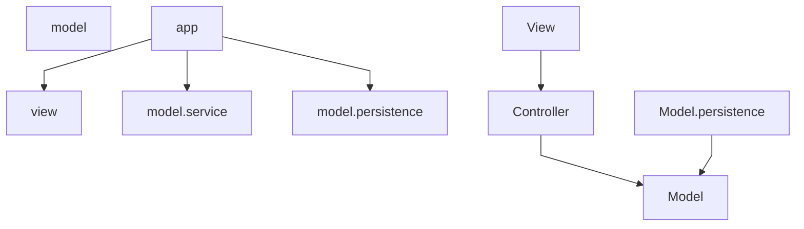

# Responsabilità e architettura

← [Home](https://github.com/ValerioGiglio04/rpg-MPGC/wiki/Home)

Ho organizzato il progetto in architettura MVC: al centro c'è il dominio (regole di gioco), intorno i casi d'uso (`model.service`), gli model.persistence verso H2 e la UI JavaFX. Il dominio non importa JavaFX, Hibernate o classi di presentazione.

---

## Layer e dipendenze



| Layer | Package | Ruolo |
|-------|---------|-------|
| **app** | `...app` | Avvio: JPA, seed catalogo, wiring di `GameModel`, JavaFX |
| **model** | `...model` | Modello, combattimento, validazione, porte (`model.persistence`) |
| **model.service** | `...model.service` | Servizi di gioco e `GameModel` per la UI |
| **model.persistence** | `...model.persistence` | Catalogo e sessioni su H2, mapping JPA/JSON |
| **view** / **controller** | `...view` | FXML, controller, navigazione — nessuna regola di business |

Le dipendenze vanno sempre verso il dominio: `ui` → `model.service` → `model`, e `model.persistence` → `model`. Vietato `model.service` → `ui` e `model.persistence` → `ui`.

---

## Componenti principali

- **`GameModel`** — unico ingresso per la UI: battaglia, cura, save/load, stato mappa.
- **`BattleService`**, **`NewGameService`**, **`HealingService`** — casi d'uso; la battaglia delega i round a `BattleRoundExecutor`.
- **`GymCompletionHandler`** — gloria e creature al KO del boss.
- **`SessionPersistenceFacade`** — save/load/delete slot tramite la porta `GameStateRepository`.
- **`GameState`** — palestra corrente, collegamenti, `canChallengeGym`, progresso campagna.
- **`GameCatalog`** — dati statici (creature, mosse, palestre); le istanze in partita sono mutabili e separate dal catalogo.
- **`AttackResolutionStrategy`** / **`BossMoveStrategy`** — algoritmi di combattimento intercambiabili (implementazioni in `model.combat.strategy.implementations`).
- **`GymStatusStrategy`** — stato palestre sulla mappa (`model.overworld.strategy`).
- **`HibernateGameCatalogLoader`**, **`HibernateGameStateRepository`** — model.persistence Hibernate; il salvataggio serializza lo stato in JSON dentro `sessioni_salvate`.
- **UI** — controller FXML sottili + controller (`BattleController`, `HubController`, …); routing in `ScreenNavigator`, costruzione schermate in `ScreenFactory`.

---

## Organizzazione package

```
it.unicam.cs.mpgc.rpg125664
├── app/                    Main, RpgApplication, AppModule
├── model/                 model, catalog, combat, event, validation, builder, port
├── model.service/            servizi, session, overworld
├── model.persistence/    catalog/, session/, base/
└── view/              navigation, actions, controller, controller,
                            component, mapper, overworld, support, theme
```

Nei package dove serve estensione uso sottocartelle **`implementations/`** (classi che implementano un contratto) e **`support/`** (helper e factory). Eccezioni volute: `model.entity`, `model.builder`, servizi in `model.service` e package UI per ruolo (controller, controller, component).

---

## Scelte di design

Ho applicato SOLID in modo concreto, non come checklist:

- **Responsabilità singola** — es. `BattleRoundExecutor` fa solo un round; i controller separano logica schermata e binding FXML.
- **Aperto/chiuso** — nuova IA boss = nuova classe `BossMoveStrategy`, senza toccare `BattleService`.
- **Dipendenze verso astrazioni** — la UI usa `GameModel`, non Hibernate; le porte (`GameStateRepository`, `GameCatalogLoader`) stanno in `model.persistence` e le implementazioni negli model.persistence.

Pattern usati: **Facade** (`GameModel`), **Builder** + **Validator** per costruire aggregati validati, **Strategy** per combattimento e mappa, **Repository** per la persistenza, **Controller** in UI. Il wiring avviene in **`AppModule`** (composition root).

Per l'elenco delle classi principali vedi [Classi e interfacce](https://github.com/ValerioGiglio04/rpg-MPGC/wiki/Classi-e-interfacce). Per persistenza ed estensioni future: [Dati e persistenza](https://github.com/ValerioGiglio04/rpg-MPGC/wiki/Dati-e-persistenza), [Estendibilità](https://github.com/ValerioGiglio04/rpg-MPGC/wiki/Estendibilita).
